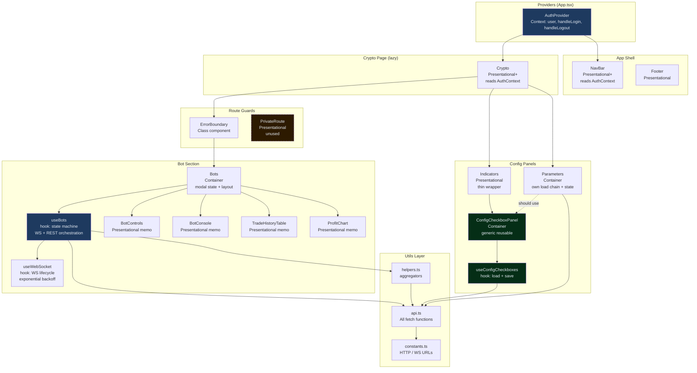

# UI Component Design & Reusability
**Prompt:** 04-WEB-UI | **Package:** web | **Reviewed:** July 2025

---

## Executive Summary

The sonarftweb component library is lean, purposeful, and well-structured. Every
component has a clear single responsibility, TypeScript props interfaces are
explicit throughout, and `React.memo` is applied correctly to all pure display
components. The standout design is `ConfigCheckboxPanel` — a properly generic,
fully reusable component that eliminates duplication between `Indicators` and any
future config panel. The main observations are: `Bots` is a medium-complexity
orchestration component that hosts two confirmation modals inline (extractable),
`Parameters` duplicates the `ConfigCheckboxPanel` pattern instead of using it,
and the CSS layer has a significant duplication between `parameters.css` and
`indicators.css` that a shared stylesheet would resolve.

---

## 1. Component Inventory

| Component | Location | Purpose | Reused? | ~Lines | Complexity |
|---|---|---|---|---|---|
| `App` | `src/App.tsx` | Root shell: router, layout, lazy page, auth provider | No | 30 | Simple |
| `NavBar` | `components/NavBar/NavBar.tsx` | Top nav: logo, links, user email | No | 25 | Simple |
| `Footer` | `components/Footer/Footer.tsx` | Static copyright footer | No | 7 | Simple |
| `ErrorBoundary` | `components/ErrorBoundary/ErrorBoundary.tsx` | Catches render errors, shows fallback + reload | Yes (1) | 45 | Simple |
| `PrivateRoute` | `components/PrivateRoute/PrivateRoute.tsx` | Auth guard — redirects if value is falsy | Yes (0 — unused) | 10 | Simple |
| `Crypto` | `pages/Crypto/Crypto.tsx` | Main trading dashboard layout | No | 25 | Simple |
| `Bots` | `components/Bots/Bots.tsx` | Bot management: controls, console, history, chart + 2 modals | No | 130 | Medium |
| `BotControls` | `components/Bots/BotControls.tsx` | Create/Stop/Remove buttons + bot selector dropdown | No | 55 | Simple |
| `BotConsole` | `components/Bots/BotConsole.tsx` | Scrolling color-coded log output | No | 35 | Simple |
| `TradeHistoryTable` | `components/Bots/TradeHistoryTable.tsx` | Tabular order/trade history with formatting | No | 60 | Simple |
| `ProfitChart` | `components/Charts/ProfitChart.tsx` | Cumulative P&L area chart (Recharts) | No | 75 | Medium |
| `Parameters` | `components/Parameters/Parameters.tsx` | Exchange/symbol/strategy config panel | No | 120 | Medium |
| `Indicators` | `components/Indicators/Indicators.tsx` | Indicator config — thin wrapper over ConfigCheckboxPanel | No | 55 | Simple |
| `ConfigCheckboxPanel` | `components/ConfigCheckboxPanel/ConfigCheckboxPanel.tsx` | Generic reusable checkbox config panel | Yes (1) | 80 | Medium |

**Total source components:** 14 (excluding hooks and utilities)

---

## 2. Presentational vs Container Pattern

| Component | Classification | Rationale |
|---|---|---|
| `App` | Container | Wires providers, router, lazy loading |
| `NavBar` | Presentational+ | Reads AuthContext directly; no API calls |
| `Footer` | Presentational | Pure render, no props, no state |
| `ErrorBoundary` | Container | Manages error state, handles reload |
| `PrivateRoute` | Presentational | Pure conditional render based on prop |
| `Crypto` | Presentational+ | Reads AuthContext, composes layout |
| `Bots` | Container | Calls `useBots`, manages modal state, orchestrates children |
| `BotControls` | Presentational | Pure render from props, no state, `React.memo` |
| `BotConsole` | Presentational | Pure render from props + scroll ref, `React.memo` |
| `TradeHistoryTable` | Presentational | Pure render from props, `React.memo` |
| `ProfitChart` | Presentational+ | Derives chart data via `useMemo`, `React.memo` |
| `Parameters` | Container | Manages config state, load chain, API calls |
| `Indicators` | Presentational | Thin config wrapper, delegates all logic to `ConfigCheckboxPanel` |
| `ConfigCheckboxPanel` | Container | Calls `useConfigCheckboxes`, manages save state |

**Separation quality:** Good. The container/presentational split is clear and
consistent. The only mixed-concern component is `Bots`, which is both a container
(calls `useBots`) and a layout component (renders modals, panels, and children).
This is a deliberate and acceptable design at the current scale.

---

## 3. Component Responsibility Analysis

### Bots — Medium complexity, one extractable concern

`Bots` has three responsibilities:
1. Consuming `useBots` and distributing state to children
2. Rendering the live-trading and remove-bot confirmation modals
3. Composing the bot panel and history panel layout

The modal logic (two `useState` flags + two JSX blocks) is the only concern that
could be cleanly extracted into a `ConfirmModal` component. The rest of `Bots` is
straightforward orchestration.

**SRP verdict:** Acceptable. The modals are tightly coupled to `Bots`-specific
actions and extracting them would add a component without meaningfully reducing
complexity. Worth extracting only if a third modal is added.

### Parameters — Duplicates ConfigCheckboxPanel pattern

`Parameters` manages its own load chain (server → localStorage → defaults),
checkbox state, strategy dropdown, and save flow — all inline. This is the same
responsibility as `ConfigCheckboxPanel` + `useConfigCheckboxes`, which `Indicators`
correctly delegates to.

**SRP verdict:** Violates DRY. `Parameters` should be refactored to use
`ConfigCheckboxPanel`, as `Indicators` does. The strategy dropdown is the only
unique element that would need to be accommodated (e.g. via a `headerSlot` prop
or by extending `ConfigCheckboxPanel`'s section model).

### ConfigCheckboxPanel — Well-designed generic component

Accepts `fetchFn`, `defaultFn`, `updateFn`, `sections`, and `storageKey` as
props, making it fully decoupled from any specific config domain. The generic
type parameter `<T extends ConfigState>` provides type safety without sacrificing
reusability.

**SRP verdict:** Clean. One responsibility: render a titled checkbox panel with
load/save behavior driven entirely by injected functions.

### BotConsole — Clean, focused

Single responsibility: render a scrollable log output with color-coded lines and
smart auto-scroll. The `getLogClass` helper is a pure function co-located with
the component — appropriate given it is only used here.

### TradeHistoryTable — Clean, focused

Single responsibility: render a formatted trade/order history table. The
`formatDate` and `formatCurrency` helpers are pure functions co-located with the
component. The legacy date format normalization (`MM-DD-YYYY` → ISO) is a
pragmatic inline fix with a clear comment.

### ErrorBoundary — Necessary class component

The only class component in the codebase, required by React's error boundary API.
Clean implementation with `getDerivedStateFromError`, `componentDidCatch`, and a
`handleReload` method. Dev-only error detail display via `import.meta.env.DEV`.

---

## 4. Props Design & Interface

All props are defined with explicit TypeScript interfaces. No `PropTypes`, no
`any` in prop definitions.

### Key component props

| Component | Prop | Required | Type | Purpose |
|---|---|---|---|---|
| `Bots` | `user` | ✅ | `AppUser` | Provides `user.id` as `clientId` to `useBots` |
| `BotControls` | `botIds` | ✅ | `string[]` | List of bot IDs for the selector |
| `BotControls` | `botState` | ✅ | `number` | Legacy `BotState.CREATED \| REMOVED` flag |
| `BotControls` | `selectedBotId` | ✅ | `string \| null` | Currently selected bot |
| `BotControls` | `wsOpen` | ✅ | `boolean` | Whether WS is connected (gates button enable) |
| `BotControls` | `onSelectBot` | ✅ | `(id: string) => void` | Bot selection callback |
| `BotControls` | `onCreate` | ✅ | `() => void` | Create bot callback |
| `BotControls` | `onStop` | ✅ | `() => void` | Stop bot callback |
| `BotControls` | `onRemove` | ✅ | `() => void` | Remove bot callback (triggers modal in Bots) |
| `BotConsole` | `logs` | ✅ | `string[]` | Log lines to display |
| `TradeHistoryTable` | `rows` | ✅ | `TradeRecord[]` | Trade/order records |
| `TradeHistoryTable` | `caption` | ✅ | `string` | Accessible table caption (sr-only) |
| `ProfitChart` | `trades` | ✅ | `TradeRecord[]` | Trade records for P&L calculation |
| `Parameters` | `clientId` | ✅ | `string` | Client identifier for API calls |
| `Indicators` | `clientId` | ✅ | `string` | Client identifier for API calls |
| `ConfigCheckboxPanel` | `title` | ✅ | `string` | Panel heading |
| `ConfigCheckboxPanel` | `clientId` | ✅ | `string` | Client identifier for API calls |
| `ConfigCheckboxPanel` | `storageKey` | ✅ | `string` | localStorage key for config cache |
| `ConfigCheckboxPanel` | `defaultState` | ✅ | `T` | Initial state before load |
| `ConfigCheckboxPanel` | `sections` | ✅ | `ConfigSection<T>[]` | Section definitions with keys, labels, tooltips |
| `ConfigCheckboxPanel` | `fetchFn` | ✅ | `(clientId: string) => Promise<T>` | Server fetch function |
| `ConfigCheckboxPanel` | `defaultFn` | ✅ | `() => Promise<T>` | Defaults fetch function |
| `ConfigCheckboxPanel` | `updateFn` | ✅ | `(clientId: string, state: T) => Promise<unknown>` | Save function |
| `ConfigCheckboxPanel` | `saveLabel` | ✅ | `string` | Save button label |
| `ConfigCheckboxPanel` | `className` | ✅ | `string` | Root element CSS class |
| `PrivateRoute` | `children` | ✅ | `React.ReactNode` | Protected content |
| `PrivateRoute` | `value` | ✅ | `unknown` | Truthy = render children, falsy = redirect |
| `ErrorBoundary` | `children` | ✅ | `React.ReactNode` | Content to protect |

**Props quality observations:**

- All props are required — no optional props with defaults, which keeps
  interfaces explicit and avoids hidden behavior.
- `BotControls.botState` uses the legacy `number` type (`BotState.CREATED = 0`,
  `BotState.REMOVED = 1`) rather than the newer `BotLifecycle` string union. This
  is a backward-compatibility shim — the underlying machine uses `BotLifecycle`
  internally and derives `botState` for `BotControls`. A future cleanup could
  replace `botState: number` with `lifecycle: BotLifecycle` in `BotControls`.
- `PrivateRoute.value` is typed as `unknown` — intentionally permissive so any
  truthy value (user object, boolean, string) can serve as the auth guard. Clear
  and flexible.
- `ConfigCheckboxPanel.className` is required rather than optional. Since every
  caller provides a distinct class (`setAndDisplayIndicators`), this is fine, but
  making it optional with a sensible default would reduce boilerplate for future
  callers.

---

## 5. Composition Patterns

**Higher-Order Components (HOCs):** None used. The codebase avoids HOCs entirely,
preferring hooks for logic composition.

**Render props:** Not used. Custom hooks serve the same purpose more cleanly.

**Hooks composition:** The primary composition pattern. `Bots` composes
`useBots` (which itself composes `useWebSocket`). `ConfigCheckboxPanel` composes
`useConfigCheckboxes`. This is the correct modern React pattern — logic is
extracted into hooks, components consume hooks.

**Children / slot pattern:** Used in `ErrorBoundary` (`children: React.ReactNode`)
and `PrivateRoute` (`children: React.ReactNode`). `App` uses `children` implicitly
via `AuthProvider`. No creative slot patterns beyond standard `children`.

**Compound components:** Not used. The closest pattern is `Bots` composing
`BotControls`, `BotConsole`, `TradeHistoryTable`, and `ProfitChart` — but these
are independent components, not a compound component pattern with shared context.

**Composition vs inheritance:** Composition throughout. `ErrorBoundary` is the
only class component and it does not extend any custom base class.

**Dependency injection via props:** `ConfigCheckboxPanel` uses prop injection for
`fetchFn`, `defaultFn`, and `updateFn` — a clean inversion of control that makes
the component testable and reusable without coupling it to specific API functions.
This is the most sophisticated composition pattern in the codebase.

---

## 6. Custom Hooks

| Hook | Location | Purpose | Used By | Side Effects | Cleanup |
|---|---|---|---|---|---|
| `useAuth` | `hooks/AuthProvider.tsx` | Convenience wrapper for `useContext(AuthContext)` | Any component needing auth | None | None |
| `useBots` | `hooks/useBots.ts` | Central orchestration: WS ticket, bot state machine, log RAF batching, REST polling | `Bots` | REST fetches, WebSocket via `useWebSocket`, RAF loop, `socket.onmessage` | RAF cancelled, WS closed via `useWebSocket` |
| `useWebSocket` | `hooks/useWebSocket.tsx` | WebSocket lifecycle with exponential backoff reconnection | `useBots` | WebSocket connection, `setTimeout` for reconnect | `shouldReconnect = false`, `socket.close()` |
| `useConfigCheckboxes` | `hooks/useConfigCheckboxes.ts` | Generic config load (server → localStorage → defaults) + save | `ConfigCheckboxPanel` | REST fetches, `localStorage` read/write, `setTimeout` for save feedback | `cancelled = true` flag |
| `useIdleTimeout` | `hooks/useIdleTimeout.ts` | Session idle detection via activity event listeners | None (unused) | `window` event listeners, `setTimeout` | Listeners removed, timer cleared |

### useBots — detailed analysis

**Dependencies:** `useWebSocket`, `getBotIds`, `getAuthToken`, `fetchWsTicket`,
`fetchAllOrders`, `fetchAllTrades`, `WS` constant.

**Effects (5 total):**
1. Keep `botIdsRef` in sync with `botIds` state
2. RAF loop — flush `logBufferRef` to `logs` state at ≤60fps
3. Resolve WS ticket URL on mount
4. Load existing bot IDs and history on mount
5. Attach `socket.onmessage` when `wsOpen` changes

**Cleanup:**
- RAF loop: `cancelAnimationFrame(rafRef.current)` ✅
- WS ticket resolve: no cancellation (fire-and-forget `setWsUrl`) — minor
- Bot load: no `AbortController` but `try/catch` handles errors ✅
- `onmessage` handler: replaced on each `wsOpen` change, no explicit cleanup
  needed since the socket itself is cleaned up by `useWebSocket` ✅

**Testability:** Moderate. The hook has many dependencies and side effects.
Testing requires mocking `useWebSocket`, all `api.ts` functions, and the RAF
loop. The existing test suite uses `vi.mock` for these. The `botMachineReducer`
is separately testable as a pure function.

### useWebSocket — detailed analysis

**Dependencies:** Native `WebSocket`, `setTimeout`.

**Reconnection:** Exponential backoff — `min(1000 * 2^attempt, 30000)ms`.
Resets `attemptRef` to 0 on successful connection.

**Cleanup:** `shouldReconnect.current = false` prevents reconnect after unmount.
`socketRef.current.close()` closes the active socket. State is reset to
`null`/`false`. ✅

**Testability:** High. The hook is self-contained with no external module
dependencies beyond the native `WebSocket` API, which is easily mocked.

### useConfigCheckboxes — detailed analysis

**Dependencies:** `fetchFn`, `defaultFn`, `updateFn` (injected), `localStorage`.

**Three-tier load chain:** Server → localStorage → bundled defaults. Each tier
is tried in sequence; the first success short-circuits the chain. A `cancelled`
boolean prevents state updates after unmount or `clientId` change.

**`stateKeys` dependency:** The load effect depends on `stateKeys` (an array).
`ConfigCheckboxPanel` memoizes `stateKeys` with `useMemo` to keep the reference
stable and prevent the effect from re-running on every render. ✅

**Cleanup:** `cancelled = true` on effect cleanup. `setTimeout` for save
feedback is not cleared on unmount — a minor memory-safe leak (the callback
calls `setSaveStatus(null)` on an unmounted component, which React 18 silently
ignores but will log a warning in strict mode). A `clearTimeout` on cleanup
would be cleaner.

---

## 7. Styling Approach

**CSS strategy:** Plain CSS files, one per component directory. No CSS-in-JS,
no CSS Modules, no Tailwind. Global class names with BEM-inspired naming
conventions (`.bots-panel`, `.bots-panel-header`, `.bot-status--running`).

**File organization:**

| File | Scope | Purpose |
|---|---|---|
| `src/reset.css` | Global | Box-sizing, margin/padding reset |
| `src/variables.css` | Global | CSS custom properties (design tokens) |
| `src/styles.css` | Global | Base typography, layout, `.card`, `:focus-visible`, scrollbar, mobile breakpoint |
| `src/index.css` | Global | Body background (minimal) |
| `src/App.css` | App | `.App`, `.page-loader`, legacy `.App-header` |
| `components/Bots/bots.css` | Component | Bot panel, controls, console, table, modals |
| `components/Charts/charts.css` | Component | Chart container, tooltip |
| `components/Parameters/parameters.css` | Component | Config panel, strategy row, checkboxes, save row |
| `components/Indicators/indicators.css` | Component | Config panel, checkboxes, save row |
| `components/NavBar/navbar.css` | Component | Nav layout, logo, links |
| `components/Footer/footer.css` | Component | Footer layout |
| `components/ErrorBoundary/errorboundary.css` | Component | Error box layout |
| `pages/Crypto/crypto.css` | Page | Dashboard grid layout |

**Design token system:** `variables.css` defines a complete dark trading
dashboard palette using CSS custom properties:

```css
--bg-base, --bg-surface, --bg-elevated, --bg-input
--text-primary, --text-secondary, --text-muted
--accent, --accent-hover, --accent-dim
--border, --border-focus
--green, --green-bg, --green-border
--red, --red-bg, --red-border
--amber, --amber-bg
```

Legacy aliases (`--backgroundPrimary`, `--buttonBackground`, etc.) are preserved
for backward compatibility. All component CSS files consume tokens exclusively —
no hardcoded color values except a few specific dark shades in `bots.css`
(`#050a14` for console background, `#0f172a` for idle badge).

**CSS duplication — significant finding:**

`parameters.css` and `indicators.css` share an almost identical block of ~60
lines covering `.checkbox-group.label`, `.save-row`, and `.save-status` rules.
The only difference is the root class (`.setAndDisplayParameters` vs
`.setAndDisplayIndicators`). This duplication exists because `Parameters` and
`Indicators` were originally separate components with separate stylesheets.
Now that `Indicators` uses `ConfigCheckboxPanel`, the shared styles should be
extracted to a single `configpanel.css` (or added to `styles.css` as shared
utility classes).

**Responsive design:** A single breakpoint at `max-width: 767px` in `styles.css`
switches the crypto dashboard from row to column layout. Component-level CSS uses
`flex-wrap: wrap` on controls rows to handle narrow viewports gracefully.

**Dark mode:** The entire palette is dark by default. No `prefers-color-scheme`
media query — the app is dark-only. This is appropriate for a trading dashboard.

**Scoping:** Global class names with no CSS Modules or Shadow DOM. Name collision
risk is low given the small number of components and the consistent naming
conventions, but it is a theoretical risk as the codebase grows.

**`:has()` selector usage:** `parameters.css` and `indicators.css` use
`:has(input:checked)` to style checked checkbox list items:

```css
.checkbox-group.label li:has(input:checked) {
    border-color: var(--accent);
    background: var(--accent-dim);
}
```

This is a modern CSS selector with broad support (Chrome 105+, Firefox 121+,
Safari 15.4+). It is not supported in older browsers, but given the trading
dashboard context and the `browserslist` config targeting modern browsers, this
is acceptable.

---

## 8. Reusable Component Library

The codebase does not have a formal component library or Storybook. Reusable
components are:

| Component | Reusable? | Current uses | Notes |
|---|---|---|---|
| `ConfigCheckboxPanel` | ✅ Yes | `Indicators` (1) | Designed for reuse; `Parameters` should also use it |
| `ErrorBoundary` | ✅ Yes | `Crypto` (1) | Could wrap any subtree |
| `PrivateRoute` | ✅ Yes | None (0) | Defined but unused |
| `TradeHistoryTable` | ✅ Yes | `Bots` (2 — orders + trades) | Used twice in same parent |
| `BotConsole` | Potentially | `Bots` (1) | Could be reused for other log streams |
| `ProfitChart` | Potentially | `Bots` (1) | Could accept any `TradeRecord[]` |

**Base components:** No dedicated base component layer (no `Button`, `Input`,
`Modal`, `Badge` primitives). Buttons and inputs are styled directly in component
CSS files. This is pragmatic at the current scale but means button styles are
defined in `bots.css`, `parameters.css`, and `indicators.css` separately.

**Consistency:** Visual consistency is maintained through the shared CSS token
system rather than shared components. All panels use the same `--bg-surface` /
`--border` / `border-radius: 8px` card pattern, defined in `styles.css` as
`.card` — though components define their own equivalent rules rather than using
the `.card` class.

**Storybook:** Not present.

---

## 9. Component Lifecycle & Hooks

### useEffect usage across components

| Component / Hook | Effect purpose | Deps | Cleanup |
|---|---|---|---|
| `useBots` | Sync `botIdsRef` | `[botIds]` | None needed |
| `useBots` | RAF log flush loop | `[]` | `cancelAnimationFrame` ✅ |
| `useBots` | Resolve WS ticket URL | `[clientId]` | None (fire-and-forget) |
| `useBots` | Load bot IDs + history | `[clientId]` | None (no abort) |
| `useBots` | Attach `socket.onmessage` | `[clientId, wsOpen, socket]` | None needed (socket cleaned up by `useWebSocket`) |
| `useWebSocket` | Connect + reconnect loop | `[url, autoReconnect]` | `shouldReconnect = false`, `socket.close()` ✅ |
| `useConfigCheckboxes` | Three-tier config load | `[clientId, storageKey, fetchFn, defaultFn, stateKeys]` | `cancelled = true` ✅ |
| `Parameters` | Three-tier config load | `[clientId]` | `cancelled = true` ✅ |
| `BotConsole` | Auto-scroll on log update | `[logs]` | None needed |

### useRef usage

| Ref | Location | Purpose |
|---|---|---|
| `logBufferRef` | `useBots` | Accumulates log messages between RAF flushes — avoids state updates per message |
| `rafRef` | `useBots` | Stores RAF handle for cancellation on unmount |
| `botIdsRef` | `useBots` | Stable reference to `botIds` for use inside `onmessage` closure |
| `socketRef` | `useWebSocket` | Stores active socket for cleanup on unmount |
| `shouldReconnect` | `useWebSocket` | Flag to prevent reconnect after unmount |
| `attemptRef` | `useWebSocket` | Reconnect attempt counter for backoff calculation |
| `preRef` | `BotConsole` | DOM ref for scroll position management |
| `saveTimer` | `Parameters` | Stores `setTimeout` handle for save feedback dismissal |
| `timerRef` | `useIdleTimeout` | Stores idle `setTimeout` handle |
| `onIdleRef` | `useIdleTimeout` | Stable ref to `onIdle` callback to avoid stale closure |

**Ref usage assessment:** All refs serve a clear purpose — either avoiding
stale closures, storing DOM references, or holding mutable values that should
not trigger re-renders. No refs are used as a workaround for missing state.

### useCallback / useMemo usage

All `useCallback` and `useMemo` usages are justified:
- Handlers passed to `React.memo` children need stable references to prevent
  unnecessary re-renders (`useBots` handlers → `BotControls`)
- `useMemo` on derived data prevents recomputation on unrelated re-renders
  (`ProfitChart` cumulative P&L, `Parameters` `Object.entries` calls)
- `useMemo` on `stateKeys` in `ConfigCheckboxPanel` prevents the
  `useConfigCheckboxes` load effect from re-running on every render

No over-memoization detected — `useCallback`/`useMemo` are not applied to
trivial inline functions or primitive values.

---

## 10. Form Components

The app does not use HTML `<form>` elements. All "form-like" interactions are
handled via controlled inputs directly in components.

**Checkbox handling:** Controlled `<input type="checkbox">` elements with
`checked={value}` and `onChange` handlers. State is updated immediately on
change and written to `localStorage` synchronously.

**Strategy dropdown:** Controlled `<select>` in `Parameters` with
`value={config.strategy}` and `onChange={handleStrategyChange}`.

**Validation:** None client-side. The API validates config keys server-side
(regex pattern, 50-entry limit). The frontend sends whatever the user has
checked — no pre-submission validation.

**Error display:** Save errors shown as inline `<span role="status">` with
`aria-live="polite"`. No field-level validation errors.

**Submit handling:** Save buttons call async handlers directly via `onClick`.
No `<form onSubmit>`. Buttons are disabled during `saveStatus === "saving"` to
prevent double-submission.

**Input components:** No reusable input primitives. Each component styles its
own inputs via component CSS.

---

## 11. Testing & Documentation

### Test coverage by component

| Component / Hook | Test file | Coverage |
|---|---|---|
| `AuthProvider` / `useAuth` | `hooks/AuthProvider.test.tsx` | Login, logout, context value |
| `useBots` | `hooks/useBots.test.ts` | State machine, WS events, handlers |
| `useConfigCheckboxes` | `hooks/useConfigCheckboxes.test.ts` | Load chain, save, checkbox change |
| `useIdleTimeout` | `hooks/useIdleTimeout.test.ts` | Timer, activity events, cleanup |
| `useWebSocket` | `hooks/useWebSocket.test.tsx` | Connect, reconnect, cleanup |
| `ErrorBoundary` | `components/ErrorBoundary/ErrorBoundary.test.tsx` | Error catch, reload |
| `PrivateRoute` | `components/PrivateRoute/PrivateRoute.test.tsx` | Auth guard redirect |
| `TradeHistoryTable` | `components/Bots/TradeHistoryTable.test.tsx` | Render, formatting |
| `App` | `App.test.tsx` | Smoke test |
| Integration | `integration/workflows.test.tsx` | End-to-end user flows |
| API utils | `utils/api.test.ts` | All fetch functions |
| Helpers | `utils/helpers.test.ts` | `fetchAllOrders`, `fetchAllTrades` |

**Notable gaps:** `Bots`, `BotControls`, `BotConsole`, `Parameters`,
`Indicators`, `ConfigCheckboxPanel`, and `ProfitChart` have no dedicated test
files. These are covered indirectly by the integration tests and `useBots` /
`useConfigCheckboxes` hook tests, but direct component tests would improve
confidence in rendering behavior and prop handling.

**Mock strategy:** MSW v2 (`src/mocks/`) intercepts all `fetch` calls at the
network level. `src/mocks/fixtures.ts` provides typed fixture data. This is a
robust approach — tests exercise the real `fetch` code paths rather than mocking
module imports.

**Snapshot testing:** Not used. Tests assert on rendered output via RTL queries
(`getByRole`, `getByText`, etc.), which is more maintainable than snapshots.

**Documentation:** No JSDoc on components or hooks. TypeScript interfaces serve
as inline documentation for props and return types. Complex logic (RAF batching,
WS ticket flow, three-tier load chain) has inline comments explaining the
rationale.

---

## 12. Code Quality Issues

| Issue | Severity | Location | Detail |
|---|---|---|---|
| CSS duplication | Medium | `parameters.css` / `indicators.css` | ~60 lines of identical `.checkbox-group`, `.save-row`, `.save-status` rules duplicated across both files |
| `Parameters` duplicates `ConfigCheckboxPanel` | Low | `Parameters.tsx` | Full load chain + state management reimplemented inline instead of using `ConfigCheckboxPanel` + `useConfigCheckboxes` |
| `PrivateRoute` unused | Low | `PrivateRoute.tsx` | Defined and tested but not wired into `App.tsx` routing |
| `BotControls.botState` uses legacy `number` type | Low | `BotControls.tsx` | `botState: number` (0/1) instead of `lifecycle: BotLifecycle` string union — a backward-compat shim that could be cleaned up |
| `saveTimer` not cleared on unmount | Low | `Parameters.tsx` | `saveTimer.current` (`setTimeout` handle) is not cleared in a `useEffect` cleanup — minor, React 18 silently ignores state updates on unmounted components |
| `useConfigCheckboxes` save timeout not cleared | Low | `useConfigCheckboxes.ts` | Same pattern — `setTimeout` for save feedback not cleared on unmount |
| `.card` class defined but not used | Info | `styles.css` | A `.card` utility class is defined in `styles.css` but components define their own equivalent panel styles instead of using it |
| `App.css` contains dead styles | Info | `App.css` | `.App-logo`, `.App-header`, `.App-link`, and the `App-logo-spin` keyframe are legacy CRA styles not used by any component |
| No base component primitives | Info | — | Buttons, inputs, and modals are styled per-component. A shared `Button` or `Modal` primitive would reduce CSS duplication as the app grows |
| `ConfigCheckboxPanel.className` required | Info | `ConfigCheckboxPanel.tsx` | Making `className` optional with a default would reduce boilerplate for callers |

---

## 13. Component Architecture Diagram



---

## Recommendations

| Priority | Finding | Recommendation |
|---|---|---|
| Medium | CSS duplication between `parameters.css` and `indicators.css` | Extract the shared `.checkbox-group`, `.save-row`, and `.save-status` rules into a shared `configpanel.css` imported by both, or add them to `styles.css` as utility classes. |
| Low | `Parameters` reimplements `ConfigCheckboxPanel` pattern | Refactor `Parameters` to use `ConfigCheckboxPanel` + `useConfigCheckboxes`. The strategy dropdown can be accommodated via an optional `headerSlot?: React.ReactNode` prop on `ConfigCheckboxPanel`. |
| Low | `PrivateRoute` is defined but unused | Either wire it into `App.tsx` route definitions (replacing the `if (!user) return null` guard in `Crypto`) or remove it to eliminate dead code. |
| Low | `BotControls.botState` uses legacy `number` type | Replace `botState: number` with `lifecycle: BotLifecycle` in `BotControls` props and update the `hasBots` derivation to `lifecycle !== "idle"`. Remove the `BotState` legacy export from `useBots`. |
| Low | `saveTimer` / save timeout not cleared on unmount | Add `useEffect` cleanup in `Parameters` to call `clearTimeout(saveTimer.current)`. Apply the same fix to `useConfigCheckboxes`. |
| Low | Dead styles in `App.css` | Remove `.App-logo`, `.App-header`, `.App-link`, and `App-logo-spin` keyframe — these are unused CRA legacy styles. |
| Info | `.card` class defined but not used by components | Either use `.card` in component JSX (replacing inline panel styles) or remove it from `styles.css` to avoid confusion. |
| Info | `ConfigCheckboxPanel.className` should be optional | Add a default value (e.g. `"config-checkbox-panel"`) so callers that don't need a custom class don't have to provide one. |
| Info | No tests for `Bots`, `Parameters`, `ConfigCheckboxPanel`, `ProfitChart` | Add direct component render tests for these four components to complement the existing hook and integration tests. |
