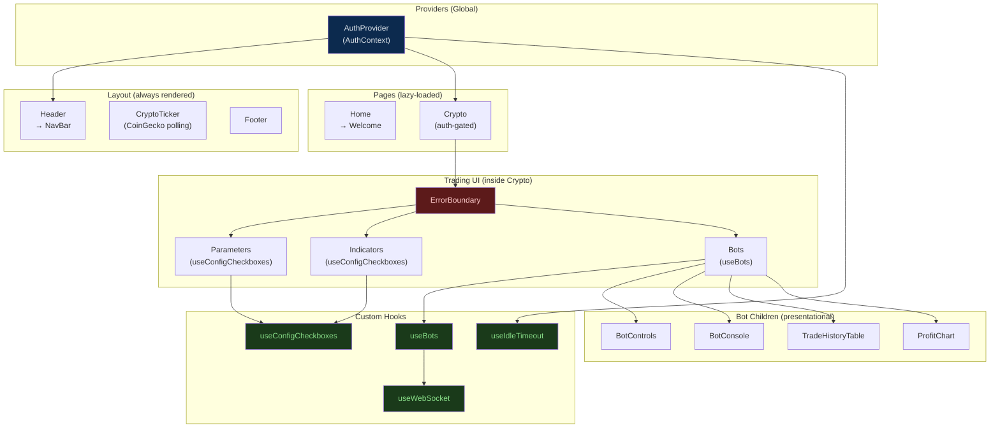

# Prompt 04 — UI Component Design & Reusability

**Package:** `packages/web`  
**Prompt ID:** 04-WEB-UI  
**Output File:** `docs/components/design-patterns.md`  
**Reviewed:** July 2025  
**API Sources:** `packages/api` included — prop-to-schema alignment verified

---

## Executive Summary

The component architecture is clean and appropriately sized for the application scope. All components are functional (except the required class-based `ErrorBoundary`), props are TypeScript-typed throughout, and logic is correctly extracted into custom hooks. The main design concerns are: two near-identical components (`Parameters` and `Indicators`) that should be unified; invalid HTML nesting in `BotConsole` and `BotControls`; a `Header` wrapper that adds no value; CSS class name collisions between component stylesheets; and the absence of any base component library (buttons, inputs, selects are styled ad-hoc per component). No component exceeds 100 lines. No prop drilling beyond one level.

---

## 1. Component Inventory

| Component | Location | Purpose | Reused? | ~Lines | Complexity |
|---|---|---|---|---|---|
| `App` | `src/App.tsx` | Root layout, router, lazy route declarations | No | 35 | Simple |
| `Header` | `components/Header/Header.tsx` | Thin wrapper around NavBar | No | 8 | Simple |
| `NavBar` | `components/NavBar/NavBar.tsx` | Navigation links + auth sign-in/out button | No | 30 | Simple |
| `Footer` | `components/Footer/Footer.tsx` | Static copyright text | No | 7 | Simple |
| `CryptoTicker` | `components/CryptoTicker/CryptoTicker.tsx` | Scrolling live price banner (CoinGecko) | No | 40 | Simple |
| `ErrorBoundary` | `components/ErrorBoundary/ErrorBoundary.tsx` | Catches render errors, shows fallback UI | Yes (1 place) | 45 | Simple |
| `PrivateRoute` | `components/PrivateRoute/PrivateRoute.tsx` | Auth guard — redirects to `/` if no value | Yes (1 place) | 10 | Simple |
| `Bots` | `components/Bots/Bots.tsx` | Bot management container — wires `useBots` to children | No | 55 | Medium |
| `BotControls` | `components/Bots/BotControls.tsx` | Create/select/remove bot buttons + dropdown | No | 35 | Simple |
| `BotConsole` | `components/Bots/BotConsole.tsx` | Scrolling log output with auto-scroll | No | 20 | Simple |
| `TradeHistoryTable` | `components/Bots/TradeHistoryTable.tsx` | Trade/order history table | No | 35 | Simple |
| `ProfitChart` | `components/Charts/ProfitChart.tsx` | Cumulative P&L area chart (Recharts) | No | 75 | Medium |
| `Parameters` | `components/Parameters/Parameters.tsx` | Exchange/symbol checkbox config form | No | 65 | Simple |
| `Indicators` | `components/Indicators/Indicators.tsx` | Indicator checkbox config form | No | 80 | Simple |
| `Crypto` | `pages/Crypto/Crypto.tsx` | Main trading page — auth-gated, composes all trading components | No | 25 | Simple |
| `Home` | `pages/Home/Home.tsx` | Landing page shell | No | 8 | Simple |
| `Welcome` | `pages/Home/Welcome/Welcome.tsx` | Hero text component | No | 10 | Simple |

No component exceeds 100 lines. The codebase is well-sized throughout.

---

## 2. Presentational vs Container Pattern

### Container Components (logic + orchestration)

| Component | Logic it owns |
|---|---|
| `Bots` | Calls `useBots`, distributes all state to children |
| `Parameters` | Calls `useConfigCheckboxes`, owns form state |
| `Indicators` | Calls `useConfigCheckboxes`, owns form state |
| `Crypto` (page) | Reads `AuthContext`, composes trading section |
| `CryptoTicker` | Owns fetch lifecycle, polling interval, price state |
| `AuthProvider` | Owns auth lifecycle, Netlify Identity events |

### Presentational Components (props in, JSX out)

| Component | Notes |
|---|---|
| `BotControls` | Pure render — all callbacks passed as props |
| `BotConsole` | Pure render — `logs: string[]` in, scrolling `<pre>` out |
| `TradeHistoryTable` | Pure render — `rows: TradeRecord[]` in, `<table>` out |
| `ProfitChart` | Near-pure — `useMemo` for data transform, no side effects |
| `Header` | Pure render — wraps `NavBar` with no added logic |
| `Footer` | Pure render — static text |
| `Welcome` | Pure render — static text |
| `PrivateRoute` | Pure render — conditional redirect |
| `ErrorBoundary` | Class component — stateful but no external dependencies |

### Assessment

Separation is good. The pattern is consistently applied: containers call hooks and pass results down; presentational components receive typed props and render. The one exception is `Parameters` and `Indicators`, which are technically containers (they call `useConfigCheckboxes`) but also own their own rendering logic including the `renderCheckboxes` helper and `TOOLTIPS` constant. This is acceptable at their current size but makes them harder to test in isolation.

---

## 3. Component Responsibility Analysis

### `Bots` — Well-scoped container

Responsibilities: call `useBots`, render status badges, compose child components. Single responsibility is respected. The `STATUS_LABELS` lookup table is defined at module level — correct.

**Minor issue:** The `h2` heading in `Bots` contains three inline elements (mode toggle button, WS status badge, bot status badge). This mixes heading semantics with interactive controls. The heading text "Bots" is not separately accessible — a screen reader reads the entire `h2` including button and badge text as one heading string.

### `Parameters` and `Indicators` — Near-identical, should be unified

Both components are structurally identical:
- Call `useConfigCheckboxes` with different arguments
- Define a `TOOLTIPS` constant
- Define a `renderCheckboxes(category)` helper
- Render a `<form>` with checkbox groups and a save button

The only differences are the category names (`exchanges`/`symbols` vs `periods`/`oscillators`/`movingaverages`), the `TOOLTIPS` content, and the heading text. This is a clear violation of DRY. A single `ConfigCheckboxPanel` component parameterised by a `sections` prop would eliminate ~120 lines of duplication.

### `ProfitChart` — Well-designed, one concern

Owns data transformation (`useMemo` over `trades`) and rendering. The `CustomTooltip` sub-component is defined in the same file — appropriate given it is only used by `ProfitChart` and is not independently reusable.

### `CryptoTicker` — Mixed concerns

Owns both data fetching (axios + `useEffect` polling) and rendering. For a component this small (~40 lines) this is acceptable, but extracting the fetch logic into a `useCryptoTicker` hook would make it testable without rendering.

### `ErrorBoundary` — Correct use of class component

`componentDidCatch` requires a class component in React 18. The implementation is correct. The `handleReload` method resets error state but does not re-mount children — if the error was caused by a data problem that persists, clicking "Try again" will immediately re-throw. This is a known limitation of the reset-state approach.

### `Header` — Unnecessary wrapper

`Header` contains only:
```tsx
const Header: React.FC = () => (
    <div className="header">
        <NavBar />
    </div>
);
```
The `header.css` adds `display: flex` and padding. This wrapper adds no logic and the styling could live in `navbar.css` or `App.tsx`. It is a one-line component that exists solely to add a `<div className="header">` wrapper. This is not harmful but is unnecessary indirection.

---

## 4. Props Design & Interface

### Key Component Props

| Component | Prop | Required | Type | Purpose |
|---|---|---|---|---|
| `Bots` | `user` | Yes | `AuthContextValue["user"] & { id: string }` | Provides `clientId` for bot operations |
| `BotControls` | `botIds` | Yes | `string[]` | Populates bot selector dropdown |
| `BotControls` | `botState` | Yes | `number` | Controls Create button disabled state |
| `BotControls` | `selectedBotId` | Yes | `string \| null` | Current dropdown selection |
| `BotControls` | `wsOpen` | Yes | `boolean` | Controls Remove button disabled state |
| `BotControls` | `onSelectBot` | Yes | `(id: string) => void` | Dropdown change handler |
| `BotControls` | `onCreate` | Yes | `() => void` | Create button handler |
| `BotControls` | `onRemove` | Yes | `() => void` | Remove button handler |
| `BotConsole` | `logs` | Yes | `string[]` | Log lines to display |
| `TradeHistoryTable` | `rows` | Yes (defaults `[]`) | `TradeRecord[]` | Table data |
| `ProfitChart` | `trades` | Yes (defaults `[]`) | `TradeRecord[]` | Chart data |
| `Parameters` | `clientId` | Yes | `string` | API identity for config fetch/save |
| `Indicators` | `clientId` | Yes | `string` | API identity for config fetch/save |
| `PrivateRoute` | `children` | Yes | `React.ReactNode` | Content to render if authenticated |
| `PrivateRoute` | `value` | Yes | `unknown` | Truthy = render children, falsy = redirect |
| `ErrorBoundary` | `children` | Yes | `React.ReactNode` | Content to protect |

### Assessment

**Strengths:**
- All props are TypeScript-typed with inline interfaces — no `any`, no PropTypes
- Callback props follow the `on*` naming convention consistently (`onCreate`, `onRemove`, `onSelectBot`)
- Default values are provided where appropriate (`rows = []`, `trades = []`)
- Props are minimal — no component receives props it doesn't use

**Issues:**

**`BotsProps` intersection type is fragile:**
```ts
interface BotsProps {
    user: AuthContextValue["user"] & { id: string };
}
```
`AuthContextValue["user"]` is `NetlifyUser | null`. Intersecting with `{ id: string }` does not narrow away `null` — TypeScript still requires a null check at the call site. The `Crypto` page works around this with a cast: `user as { id: string; email?: string }`. A dedicated `AuthenticatedUser` type would be cleaner and safer.

**`PrivateRoute.value: unknown` loses type information:**
The `value` prop accepts `unknown`, which means the call site gets no type guidance. Since `PrivateRoute` only checks truthiness, this works at runtime, but a generic type parameter would be more expressive:
```ts
interface PrivateRouteProps<T> {
    children: React.ReactNode;
    value: T | null | undefined;
}
```

**`BotControls` receives 7 props — approaching the complexity threshold:**
Seven props is not excessive, but it signals that `BotControls` is tightly coupled to `useBots`'s return shape. If `useBots` grows, `BotControls` props will grow with it. Passing a single `botControls` object prop (a slice of `UseBotsReturn`) would reduce the coupling.

**No default props for required props** — all required props must be provided at the call site. This is correct TypeScript practice; no issues here.

---

## 5. Composition Patterns

### Hooks Composition (primary pattern)

The dominant composition pattern is **hook extraction**: all stateful logic lives in custom hooks, components receive the results as props or call hooks directly. This is the correct modern React pattern.

```
Crypto (page)
  └── reads AuthContext (hook composition via useContext)
        └── passes user.id to:
              ├── Bots → useBots (hook)
              │     └── useWebSocket (hook)
              ├── Parameters → useConfigCheckboxes (hook)
              └── Indicators → useConfigCheckboxes (hook)
```

### Children / Slot Pattern

Used in `ErrorBoundary` and `PrivateRoute` — both accept `children: React.ReactNode` and conditionally render them. This is the standard React composition pattern, correctly applied.

`AuthProvider` also uses `children` to wrap the entire app — correct provider pattern.

### Higher-Order Components

None used. The `PrivateRoute` component serves the auth-guard role that HOCs traditionally filled, but it is implemented as a regular component — the preferred modern approach.

### Render Props

Not used. No cases where render props would be beneficial were identified.

### Compound Components

Not used. The `Bots` / `BotControls` / `BotConsole` group is the closest thing — they are designed to work together — but they are not formally compound components (no shared context, no `Bots.Controls` sub-component pattern). This is fine at the current scale.

### Lazy Loading

`App.tsx` correctly uses `React.lazy` + `Suspense` for page-level code splitting:
```tsx
const Home = lazy(() => import("./pages/Home/Home"));
const Crypto = lazy(() => import("./pages/Crypto/Crypto"));
```
Only the pages that are actually navigated to are loaded. The `PageLoader` fallback is a simple text div — functional but minimal.

**Gap:** `Dex`, `Forex`, `Token`, `CryptoChatGPT`, and `Doggy` pages exist in the filesystem but are not registered in the router. They are dead code — either placeholder pages that were never wired up, or routes that were removed without cleaning up the files.

---

## 6. Custom Hooks

| Hook | Purpose | Used By | Dependencies | Side Effects | Cleanup |
|---|---|---|---|---|---|
| `useWebSocket` | WS connection with exponential backoff reconnect | `useBots` | `url: string`, `autoReconnect: boolean` | Opens WebSocket, sets timers | ✅ Closes socket, clears `shouldReconnect` |
| `useBots` | Bot lifecycle, WS messages, trade history | `Bots` | `clientId: string`, `useWebSocket`, `utils/api` | REST fetches, WS message handler | ⚠️ Partial — see below |
| `useConfigCheckboxes` | Generic config form: fetch → localStorage → defaults, save | `Parameters`, `Indicators` | `storageKey`, `fetchFn`, `defaultFn`, `updateFn`, `stateKeys`, `clientId` | REST fetches, localStorage read/write | ⚠️ No AbortController |
| `useIdleTimeout` | Session idle detection via DOM events | `AuthProvider` | `onIdle: () => void`, `timeoutMs: number`, `enabled: boolean` | Adds/removes DOM event listeners, sets timer | ✅ Removes listeners, clears timer |
| `AuthProvider` (context + hook) | Netlify Identity auth state, idle timeout | `NavBar`, `Crypto` | `netlifyIdentity`, `useIdleTimeout` | Netlify Identity init, event listeners | ✅ Removes Netlify Identity listeners |

### Hook Quality Notes

**`useWebSocket` — well-designed:**
- `shouldReconnect` ref correctly prevents reconnection after unmount
- Exponential backoff capped at 30 seconds
- `attemptRef` reset to 0 on successful connection
- Socket closed in cleanup via functional `setSocket` updater
- Fully tested

**`useBots` — most complex, partial cleanup concern:**
The `socket.onmessage` assignment inside `useEffect` is not explicitly cleaned up — the old handler is replaced when the effect re-runs, but if the component unmounts while a `getBotIds` async call is in flight, the `setState` calls inside the `async` handler will fire on an unmounted component. React 18 no longer throws for this, but it is wasted work and can cause subtle state bugs if the component remounts quickly.

```ts
// Current — no cleanup of in-flight async work
socket.onmessage = async (event) => {
    const ids = await getBotIds(clientId);  // ← can resolve after unmount
    setBotIds(ids);                          // ← called on unmounted component
};
```

**`useConfigCheckboxes` — missing AbortController:**
The `load` async function inside `useEffect` fires REST requests with no cancellation. If `clientId` changes (e.g., user switches account), the old request can resolve after the new one and overwrite the correct state. An `AbortController` would prevent this.

**`useIdleTimeout` — correctly implemented:**
Uses `onIdleRef` to avoid stale closure on the `onIdle` callback. Event listeners use `{ passive: true }` for scroll performance. Cleanup is thorough.

**Hook naming consistency:**
All hooks follow the `use*` convention. `AuthProvider` is the one exception — it exports both a component (`AuthProvider`) and a context (`AuthContext`) from the same file. The hook pattern (`useAuth`) is not exported, requiring consumers to call `useContext(AuthContext)` directly. A `useAuth` convenience hook would be a minor improvement.

---

## 7. Styling Approach

### Strategy: Plain CSS with Custom Properties

The application uses plain CSS files co-located with each component. No CSS Modules, no CSS-in-JS, no Tailwind. Global design tokens are defined in `src/variables.css` as CSS custom properties:

```css
:root {
    --backgroundPrimary: #000814;
    --backgroundSecondary: #0c2a4e;
    --textPrimary: #dae1e7;
    --borderPrimary: #528afc;
    --buttonBackground: #75a0fc;
    /* ... 12 tokens total */
}
```

These tokens are used consistently across all component CSS files. The design is a dark theme (near-black backgrounds, blue accents, light text).

### CSS File Organization

Each component directory contains one CSS file named after the component in lowercase (`bots.css`, `navbar.css`, etc.). CSS is imported directly in the component file. This is a clear, predictable convention.

### Style Scoping — Class Name Collision Risk

Plain CSS has no automatic scoping. Several class names are defined in multiple files:

| Class name | Defined in |
|---|---|
| `.checkbox-group` | `indicators.css` AND `parameters.css` |
| `.save-row` | `indicators.css` AND `parameters.css` |
| `.save-status` | `indicators.css` AND `parameters.css` |
| `.save-status--saving/saved/error` | `indicators.css` AND `parameters.css` |
| `.bots-container` | `bots.css` AND `crypto.css` |
| `.parameters-container` | `crypto.css` (layout) AND `parameters.css` (component) |

The duplicated `.checkbox-group`, `.save-row`, and `.save-status` rules in `indicators.css` and `parameters.css` are identical — they exist because both components were built independently. Since both are rendered on the same page simultaneously, the last-imported CSS wins for any conflicting rules. Currently the rules are identical so there is no visual bug, but this is fragile.

The `.bots-container` class is defined in both `bots.css` (flex column) and `crypto.css` (flex column + width). Both apply to the same element — the `crypto.css` definition overrides `bots.css` for width. This works by accident of import order.

**Recommendation:** Migrate to CSS Modules (`.module.css`) to eliminate collision risk, or at minimum namespace all classes with the component name (e.g., `.Parameters__save-row`).

### Responsive Design

Responsive breakpoints are defined in `styles.css` using explicit `min-width`/`max-width` ranges:

| Breakpoint | Range |
|---|---|
| Mobile | 360px – 639px |
| Mobile (alt) | 375px – 666px |
| Mobile (alt) | 412px – 731px |
| Tablet | 768px – 1023px |
| Tablet/Desktop | 1024px – 1365px |
| Desktop | 1366px – 1919px |
| Large Desktop | 1920px – 2559px |
| Ultra-wide | 2560px+ |

`NavBar` has its own responsive breakpoints in `navbar.css`. The trading interface (`crypto.css`) switches to `flex-direction: column` on mobile.

**Issues with the breakpoint strategy:**
- Overlapping ranges: the three mobile ranges (360–639, 375–666, 412–731) overlap significantly. A device at 412px wide matches all three, with the last one winning. This is confusing and likely unintentional.
- The approach is not mobile-first — it uses explicit ranges rather than `min-width` only, which means styles can be accidentally overridden.
- The `CryptoTicker` scroll animation has a fixed 270-second duration regardless of screen width or number of coins — on mobile with fewer visible items the animation will appear very slow.

### Dark Mode

The application is dark-themed by default. There is no light mode or `prefers-color-scheme` media query support. The `--backgroundTertiary: #e0e0e0` token is a light grey used for form backgrounds — this creates a mixed dark/light appearance in the config panels that may be intentional (form fields on light background) but is visually inconsistent with the rest of the dark UI.

### Global Style Conflicts

Three global CSS files are loaded in `index.tsx`:
1. `reset.css` — `* { margin: 0; padding: 0; box-sizing: border-box }`
2. `variables.css` — CSS custom properties
3. `index.css` — `body` font and background

`styles.css` is imported in `App.tsx` and also sets `* { box-sizing: border-box; margin: 0; padding: 0 }` — duplicating `reset.css`. Both files apply the same reset rules. One should be removed.

`App.css` contains `.App-logo`, `.App-header`, `.App-link`, and a spin animation — these appear to be leftover from the Create React App template and are not used in the current application.

---

## 8. Reusable Component Library

### Current State: No Base Component Library

There are no shared base components (Button, Input, Select, Checkbox, etc.). Every component styles its own interactive elements independently:

| Element | Styled in |
|---|---|
| Buttons | `crypto.css` (`.parameters-container button`, `.bots-container button`), `navbar.css` (`.sectionLogin button`), `errorboundary.css`, `bots.css` (`.mode-toggle`) |
| Select | `crypto.css` (`.bots-container h2 select`) |
| Checkboxes | `indicators.css`, `parameters.css` |
| Table | `bots.css` (`.tradehistory-table`) |

This means button styles are defined in at least 4 different places. The visual result is consistent because all use the same CSS variables, but any button style change requires updating multiple files.

### Existing Reusable Components

The closest things to reusable base components are:

| Component | Reusability | Notes |
|---|---|---|
| `ErrorBoundary` | High — generic, accepts any children | Used once but designed for reuse |
| `PrivateRoute` | High — generic auth guard | Used once but designed for reuse |
| `TradeHistoryTable` | Medium — accepts `TradeRecord[]` | Used twice (orders + trades) |
| `BotConsole` | Medium — accepts `string[]` | Could be used for any log stream |
| `ProfitChart` | Low — tightly coupled to `TradeRecord` shape | Domain-specific |

### Storybook / Documentation

No Storybook or component documentation tool is present. Components are not documented beyond their TypeScript interfaces.

---

## 9. Component Lifecycle & Hooks Usage

### `useEffect` Usage

| Location | Purpose | Dependencies | Cleanup |
|---|---|---|---|
| `AuthProvider` | Netlify Identity init + event listeners | `[handleLoginSuccess, handleLogoutSuccess]` | ✅ Removes listeners |
| `useBots` — load | Initial `getBotIds` fetch | `[clientId]` | ❌ No AbortController |
| `useBots` — WS handler | Assigns `socket.onmessage` | `[clientId, wsOpen, socket, botIds]` | ⚠️ Handler replaced but async work not cancelled |
| `useWebSocket` | Opens WS, manages reconnect | `[url, autoReconnect]` | ✅ Closes socket, sets `shouldReconnect = false` |
| `useConfigCheckboxes` — load | Three-tier config fetch | `[clientId]` (suppressed) | ❌ No AbortController |
| `useIdleTimeout` | Attaches DOM event listeners, starts timer | `[enabled, resetTimer]` | ✅ Removes listeners, clears timer |
| `BotConsole` | Auto-scroll to bottom on new logs | `[logs]` | N/A (no cleanup needed) |
| `CryptoTicker` | CoinGecko polling interval | `[]` | ✅ `clearInterval` |

### `useCallback` Usage

All event handlers in `useBots` (`handleCreate`, `handleRemove`, `handleToggleSimulation`) and `useConfigCheckboxes` (`handleCheckboxChange`, `handleSave`) are wrapped in `useCallback`. `AuthProvider` handlers are also memoized. This is correct — it prevents child components from re-rendering due to new function references on every render.

### `useMemo` Usage

- `AuthProvider` context value — correct, prevents context consumers from re-rendering
- `ProfitChart` data transform — correct, expensive computation over `trades` array

### `useRef` Usage

| Ref | Location | Purpose |
|---|---|---|
| `endRef` | `BotConsole` | DOM ref for scroll-to-bottom |
| `shouldReconnect` | `useWebSocket` | Prevents reconnect after unmount |
| `attemptRef` | `useWebSocket` | Tracks backoff attempt count |
| `timerRef` | `useIdleTimeout` | Holds setTimeout handle |
| `onIdleRef` | `useIdleTimeout` | Stable ref to `onIdle` callback (avoids stale closure) |

All refs are used appropriately — either for DOM access or for mutable values that should not trigger re-renders.

---

## 10. Form Components

### Form Pattern

Both `Parameters` and `Indicators` use HTML `<form>` elements with controlled `<input type="checkbox">` elements. Form state is managed by `useConfigCheckboxes`.

```tsx
<form>
    <div className="checkbox-group label">
        <h3>Exchanges</h3>
        <ul>{renderCheckboxes("exchanges")}</ul>
        <div className="save-row">
            <button type="button" onClick={handleSave} disabled={saveStatus === "saving"}>
                Set bot parameters
            </button>
        </div>
    </div>
</form>
```

### Controlled Inputs

All checkboxes are fully controlled:
```tsx
<input
    type="checkbox"
    name={item}
    checked={options[item] ?? false}
    onChange={(e) => handleCheckboxChange(e, category)}
/>
```
The `?? false` fallback correctly handles the case where a key exists in the config object but has no value.

### Validation

**No client-side validation.** The config forms accept whatever checkbox state the user sets and send it directly to the API. Server-side validation (Pydantic `_CONFIG_KEY_RE` regex) will reject malformed keys, but since the keys are generated from the server's own response data (not free-text user input), this is not a practical risk.

### Submit Handling

The save button uses `type="button"` with an `onClick` handler rather than `type="submit"` with an `onSubmit` form handler. This means pressing Enter in the form does not trigger a save — which is correct behaviour for a checkbox form where Enter should not accidentally submit.

**Issue — `<form>` wrapper adds no value:** Since there is no `onSubmit` handler and the button is `type="button"`, the `<form>` element serves no semantic or functional purpose. It should either be given an `onSubmit` handler (and the button changed to `type="submit"`) or replaced with a `<div>`.

### Error Display

Save errors are shown inline next to the save button via the `saveStatus` state:
```tsx
{saveStatus && (
    <span className={`save-status save-status--${saveStatus}`}>
        {SAVE_MESSAGES[saveStatus]}
    </span>
)}
```
This is clear and well-positioned. The error message ("✗ Error — try again") auto-clears after 3 seconds.

**Gap:** There is no per-field validation error display. Since the form only has checkboxes (boolean values), this is not a concern for the current implementation.

---

## 11. Testing & Documentation

### Test Coverage by Component

| Component / Hook | Test file | Coverage |
|---|---|---|
| `ErrorBoundary` | `ErrorBoundary.test.tsx` | ✅ Render, error state, reset |
| `PrivateRoute` | `PrivateRoute.test.tsx` | ✅ Auth/no-auth, undefined value |
| `TradeHistoryTable` | `TradeHistoryTable.test.tsx` | ✅ Headers, rows, empty state, symbol format |
| `useWebSocket` | `useWebSocket.test.tsx` | ✅ Connect, error, cleanup, backoff |
| `useConfigCheckboxes` | `useConfigCheckboxes.test.ts` | ✅ Load, fallback, checkbox change, save |
| `useIdleTimeout` | `useIdleTimeout.test.ts` | ✅ Timeout, reset, disable, cleanup |
| `App` | `App.test.tsx` | ✅ Smoke tests (render, logo, nav) |
| `Parameters` | `workflows.test.tsx` | ⚠️ Integration only — stale URLs |
| `Indicators` | `workflows.test.tsx` | ⚠️ Integration only — stale URLs |
| `useBots` | — | ❌ No tests |
| `Bots` | — | ❌ No tests |
| `BotControls` | — | ❌ No tests |
| `BotConsole` | — | ❌ No tests |
| `ProfitChart` | — | ❌ No tests |
| `CryptoTicker` | — | ❌ No tests |
| `NavBar` | — | ❌ No tests |
| `AuthProvider` | — | ❌ No tests |

### Snapshot Testing

No snapshot tests are used. This is the correct choice — snapshot tests are brittle and provide low signal for component behaviour.

### Mock Strategy

The mock layer is well-structured:
- `mocks/fixtures.ts` — typed fixture data
- `mocks/handlers.ts` — MSW v2 handlers for all REST endpoints
- `mocks/server.ts` — MSW node server for integration tests

MSW is set up but the `setupTests.ts` file should be checked to confirm the server is started/reset/stopped around tests.

### Documentation

No JSDoc, no Storybook, no README per component. TypeScript interfaces serve as the only formal documentation of component contracts. For a small codebase this is acceptable, but `useBots` in particular would benefit from inline comments explaining the WS message handling flow.

---

## 12. Code Quality Issues

### Invalid HTML Nesting

**`BotConsole` — `<ul><pre>` nesting:**
```tsx
<ul>
    <pre className="console">
        {logs.join("\n")}
        <div ref={endRef} />
    </pre>
</ul>
```
`<pre>` is not a valid child of `<ul>`. The `<ul>` wrapper serves no purpose here — `<pre>` should be the root element. Additionally, `<div>` inside `<pre>` is invalid (block element inside phrasing content).

**`BotControls` — buttons directly in `<ul>`:**
```tsx
<ul>
    <button onClick={onCreate} ...>Create New Bot</button>
    <select ...>...</select>
    <button onClick={onRemove} ...>Remove Bot</button>
</ul>
```
`<button>` and `<select>` are not valid children of `<ul>` — only `<li>` elements are. The `<ul>` wrapper should be replaced with a `<div>` or `<nav>`, or each control should be wrapped in `<li>`.

**`Home.tsx` — nested `<main>` elements:**
```tsx
const Home: React.FC = () => (
    <main className="home-container">
        <main className="welcome-container">  {/* ← second <main> */}
            <Welcome />
        </main>
    </main>
);
```
A page must have at most one `<main>` landmark. The inner `<main>` should be a `<div>` or `<section>`.

**`Welcome.tsx` — `<main>` inside a page that already has `<main>`:**
```tsx
const Welcome: React.FC = () => (
    <main className="welcome-container">  {/* ← third <main> on the page */}
```
`App.tsx` wraps routes in `<main className="main-container">`, `Home.tsx` adds another `<main>`, and `Welcome.tsx` adds a third. The page has three `<main>` elements — a significant accessibility violation.

### CSS Class Name Collisions

As documented in Section 7: `.checkbox-group`, `.save-row`, `.save-status`, `.bots-container`, and `.parameters-container` are defined in multiple CSS files. Currently harmless due to identical rules, but fragile.

### Dead Code

The following page files exist but are not registered in the router:
- `pages/Dex/Dex.tsx`
- `pages/Forex/Forex.tsx`
- `pages/Token/Token.tsx`
- `pages/CryptoChatGPT/CryptoChatGPT.tsx` (imported in `App.tsx` but route is missing)
- `pages/Doggy/Doggy.tsx` (route exists but page appears to be a placeholder)
- `components/Building/Building.tsx`
- `components/CChatGPT/CChatGPT.tsx`
- `components/DoggyWelcome/DoggyWelcome.tsx`

`App.css` contains unused CRA template styles (`.App-logo`, `.App-header`, `.App-link`, spin animation).

### Magic Values

Hardcoded values found in component files:

| Value | Location | Should be |
|---|---|---|
| `270s` (ticker animation duration) | `cryptoticker.css` | CSS variable or prop |
| `300px` (console height) | `bots.css` | CSS variable |
| `200px` (table max-height) | `bots.css` | CSS variable |
| `180000` (3-minute poll interval) | `CryptoTicker.tsx` | Named constant |
| `500` (max log lines) | `useBots.ts` | Already a named constant ✅ |

---

## 13. Component Architecture Diagram



**Legend:**
- Blue — global providers
- Green — custom hooks
- Red — error boundary

---

## Findings Summary

| # | Finding | Severity | File |
|---|---|---|---|
| 1 | `BotConsole`: `<ul><pre><div>` — triple invalid HTML nesting | Medium | `components/Bots/BotConsole.tsx` |
| 2 | `BotControls`: `<button>` and `<select>` directly inside `<ul>` — invalid HTML | Medium | `components/Bots/BotControls.tsx` |
| 3 | Three `<main>` elements on the Home page — accessibility violation | Medium | `pages/Home/Home.tsx`, `pages/Home/Welcome/Welcome.tsx`, `App.tsx` |
| 4 | `Parameters` and `Indicators` are near-identical — ~120 lines of duplication | Medium | `components/Parameters/`, `components/Indicators/` |
| 5 | CSS class name collisions: `.checkbox-group`, `.save-row`, `.save-status`, `.bots-container` defined in multiple files | Medium | `indicators.css`, `parameters.css`, `bots.css`, `crypto.css` |
| 6 | `useConfigCheckboxes` missing `AbortController` — stale response can overwrite correct state on `clientId` change | Medium | `hooks/useConfigCheckboxes.ts` |
| 7 | `Header` component is a one-line wrapper with no added value | Low | `components/Header/Header.tsx` |
| 8 | `<form>` wrapper in `Parameters`/`Indicators` has no `onSubmit` — semantically incorrect | Low | `components/Parameters/Parameters.tsx`, `components/Indicators/Indicators.tsx` |
| 9 | Overlapping CSS breakpoint ranges in `styles.css` — three mobile ranges overlap | Low | `src/styles.css` |
| 10 | `reset.css` and `styles.css` both define `* { margin: 0; padding: 0; box-sizing: border-box }` — duplicate reset | Low | `src/reset.css`, `src/styles.css` |
| 11 | `App.css` contains unused CRA template styles | Low | `src/App.css` |
| 12 | 8 dead component/page files not registered in router | Low | `pages/Dex/`, `pages/Forex/`, `pages/Token/`, `components/Building/`, `components/CChatGPT/`, `components/DoggyWelcome/` |
| 13 | No `useAuth` convenience hook — consumers must call `useContext(AuthContext)` directly | Low | `hooks/AuthProvider.tsx` |
| 14 | `BotControls`, `BotConsole`, `TradeHistoryTable` not wrapped in `React.memo` | Low | `components/Bots/` |
| 15 | CoinGecko poll interval `180000` is a magic number in `CryptoTicker` | Low | `components/CryptoTicker/CryptoTicker.tsx` |

---

## Recommendations

**Priority 1 — Fix HTML validity (accessibility)**

1. Fix `BotConsole` — replace `<ul><pre><div>` with just `<pre>` + `<span ref={endRef} />`:
   ```tsx
   <pre className="console">
       {logs.join("\n")}
       <span ref={endRef} />
   </pre>
   ```

2. Fix `BotControls` — replace `<ul>` with `<div className="bot-controls">` or wrap each control in `<li>`.

3. Fix `Home` / `Welcome` — replace inner `<main>` elements with `<section>` or `<div>`.

**Priority 2 — Eliminate duplication**

4. Create a single `ConfigCheckboxPanel` component to replace both `Parameters` and `Indicators`:
   ```tsx
   interface Section { key: string; label: string; tooltips: Record<string, string>; }
   interface ConfigCheckboxPanelProps {
       title: string;
       clientId: string;
       sections: Section[];
       storageKey: string;
       fetchFn: ...; defaultFn: ...; updateFn: ...;
   }
   ```

5. Create a shared `Button` base component using CSS variables, used by all components.

**Priority 3 — CSS hygiene**

6. Migrate to CSS Modules to eliminate class name collision risk, or namespace all classes with the component name prefix.

7. Remove `reset.css` (duplicate of `styles.css` reset) and remove unused `App.css` CRA template styles.

8. Fix overlapping mobile breakpoints — use a single `min-width` mobile breakpoint instead of three overlapping ranges.

**Priority 4 — Minor improvements**

9. Export a `useAuth` hook from `AuthProvider.tsx`:
   ```ts
   export const useAuth = () => useContext(AuthContext);
   ```

10. Remove dead page/component files or add a `// TODO: placeholder` comment to make intent clear.

11. Extract `CryptoTicker` fetch logic into a `useCryptoTicker` hook to enable testing without rendering.
