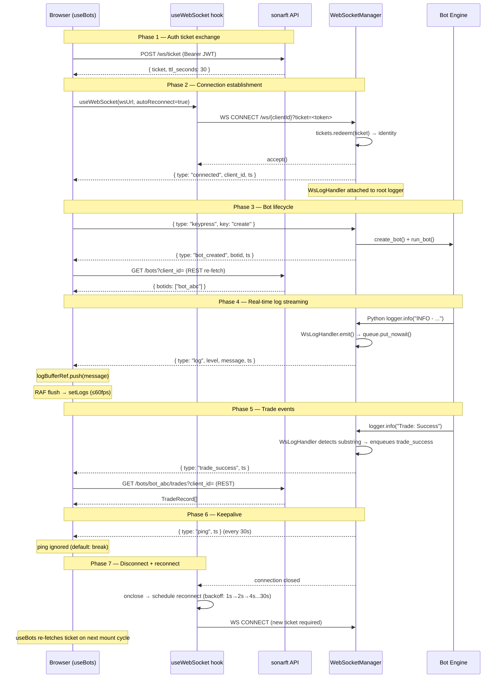

# Real-time Updates & WebSocket Integration
**Prompt:** 05-WEB-REALTIME | **Package:** web | **Reviewed:** July 2025

---

## Executive Summary

The WebSocket integration is one of the strongest parts of the sonarftweb
codebase. The ticket-based auth pattern is correctly implemented end-to-end,
the exponential backoff reconnection logic is clean and well-bounded, and the
RAF log-batching pattern elegantly solves the high-frequency re-render problem.
The server-side `WebSocketManager` is well-structured with a per-client queue,
a dedicated log handler, and proper cleanup on disconnect. The main gaps are:
the `bot_stopped` event is emitted by the server but silently ignored by the
frontend, `set_simulation` has no server confirmation event so the UI can drift
from server state, and there is no client-side heartbeat to detect silently
dropped connections before the server's 30-second ping fires.

---

## 1. WebSocket Architecture

**Library:** Native browser `WebSocket` API. No Socket.io, no third-party
library. The connection is managed entirely by the `useWebSocket` custom hook.

**Connection setup:** `useWebSocket` is called from `useBots` with the resolved
WS URL. The hook creates a `new WebSocket(url)` inside a `useEffect` and wires
`onopen`, `onerror`, and `onclose` handlers.

**Endpoint:** `ws://localhost:8000/api/v1/ws/{clientId}` (dev) or
`wss://api.sonarft.com/ws/{clientId}` (prod), with auth appended as a query
parameter:
- Preferred: `?ticket=<single-use-opaque-token>` (30s TTL)
- Legacy fallback: `?token=<jwt>`
- Dev fallback: no auth parameter

**Authentication flow:**

```
useBots (mount)
  → POST /ws/ticket (Bearer JWT)
  ← { ticket: "<token>", ttl_seconds: 30 }
  → WS CONNECT /ws/{clientId}?ticket=<token>

Server (websocket.py):
  → tickets.redeem(ticket) → identity or None
  → if None: close(1008)
  → if valid: _TICKET_VERIFIED_SENTINEL passed to verify_token()
  → verify_token(sentinel) → returns immediately (pre-verified)
```

The ticket is a `secrets.token_urlsafe(32)` string stored in an in-memory
`TicketStore` with a 30-second TTL. It is consumed on first use — replaying
a ticket returns `None`. The store evicts expired tickets on each `issue()`
call and caps at 10,000 tickets to prevent memory exhaustion.

**Configuration:** WS base URL is read from `VITE_WS_URL` env var, falling
back to `ws://localhost:8000/api/v1/ws`. Per-environment via `.env.development`
and `.env.production`.

**Singleton pattern:** One WebSocket connection per `useBots` instance. Since
`useBots` is called once (in `Bots`, which is rendered once), there is
effectively one connection per page session. The server-side `WebSocketManager`
closes any existing connection for a `client_id` before accepting a new one,
preventing duplicate connections on reconnect.

---

## 2. Connection Lifecycle

### Establishment

```
useWebSocket effect fires (url, autoReconnect)
  → shouldReconnect.current = true
  → attemptRef.current = 0
  → connect() called
      → new WebSocket(url)
      → ws.onopen: attemptRef = 0, setWsError(null), setWsOpen(true),
                   socketRef.current = ws, setSocket(ws)
      → ws.onerror: setWsError("WebSocket connection error — check server status")
      → ws.onclose: setWsOpen(false), socketRef = null, setSocket(null)
                    → if autoReconnect && shouldReconnect: schedule reconnect
```

### Reconnection — exponential backoff

```typescript
const delay = Math.min(
    BACKOFF_BASE_MS * Math.pow(2, attemptRef.current),  // 1000 * 2^n
    BACKOFF_MAX_MS                                        // cap at 30000ms
);
attemptRef.current += 1;
setTimeout(connect, delay);
```

Backoff schedule: 1s → 2s → 4s → 8s → 16s → 30s (capped). Resets to 0 on
successful `onopen`. This is a well-implemented pattern — bounded, progressive,
and self-resetting.

### Cleanup on unmount

```typescript
return () => {
    shouldReconnect.current = false;   // prevents reconnect after unmount
    if (socketRef.current) {
        socketRef.current.close();     // closes active socket
        socketRef.current = null;
    }
    setSocket(null);
    setWsOpen(false);
};
```

`shouldReconnect.current = false` is set before `close()`, which means the
`onclose` handler fires but finds `shouldReconnect.current === false` and does
not schedule a reconnect. Clean and correct. ✅

### URL change handling

When `wsUrl` changes in `useBots` (e.g. on `clientId` change), `useWebSocket`
re-runs its effect because `url` is in the dependency array. The cleanup
function closes the old socket before the new one is created. ✅

### Server-side connection management

The server's `WebSocketManager.handle_connection` closes any existing connection
for the same `client_id` before accepting the new one (`existing.close(1001)`).
This prevents ghost connections accumulating on rapid reconnects.

---

## 3. WebSocket Events

### Server → Client events

| Event type | Payload fields | Handler in `useBots` | Frequency | State update |
|---|---|---|---|---|
| `connected` | `client_id`, `ts` | Ignored (no `case`) | Once per connect | None |
| `log` | `level`, `message`, `ts` | `logBufferRef.current.push(message)` | High (continuous) | `logs` via RAF flush |
| `bot_created` | `botid`, `ts` | REST re-fetch bot IDs + `dispatch(BOT_CREATED)` | On bot creation | `botIds`, `selectedBotId`, `machine` |
| `bot_removed` | `botid`, `ts` | `dispatch(BOT_REMOVED)` + clear bot IDs | On bot removal | `botIds`, `selectedBotId`, `machine` |
| `bot_stopped` | `botid`, `ts` | **Silently ignored** (falls to `default: break`) | On bot stop | None |
| `order_success` | `ts` | `fetchAllOrders(botIdsRef.current, clientId)` | Per order fill | `orders` |
| `trade_success` | `ts` | `fetchAllTrades(botIdsRef.current, clientId)` | Per trade | `trades` |
| `error` | `message`, `ts` | `setFetchError(message)` | On command failure | `fetchError` |
| `ping` | `ts` | Ignored (falls to `default: break`) | Every 30s | None |

### Client → Server commands

| Key | Additional fields | Sent from | Trigger |
|---|---|---|---|
| `create` | — | `handleCreate` | User clicks "+ Create Bot" |
| `stop` | `botid` | `handleStop` | User clicks "■ Stop" |
| `remove` | `botid` | `handleRemove` | User confirms remove modal |
| `set_simulation` | `botid`, `value: boolean` | `handleToggleSimulation` | User confirms mode toggle |

All commands are sent as JSON strings via `socket.send(JSON.stringify({type: "keypress", key, ...}))`.

### Server-side command handling (from `manager.py`)

The server reads `event.get("key")` — note the frontend sends `type: "keypress"`
and `key: "create"`, while the server reads only `key`. The `type` field is
ignored server-side. This is consistent and works correctly.

**`set_simulation` server behavior:** The server calls
`bot_manager.set_simulation_mode(botid, value)` and catches exceptions, but
sends **no confirmation event** back to the client on success. The frontend's
`isSimulating` toggle is therefore purely optimistic — confirmed only by the
absence of an `error` event.

**`order_success` / `trade_success` server origin:** These events are not
dispatched by command handlers. They are emitted by `WsLogHandler.emit()` when
it detects `"Order: Success"` or `"Trade: Success"` in a bot log line. This is
a log-scraping pattern — the events are derived from log content rather than
from explicit bot lifecycle callbacks.

---

## 4. Real-time Data Integration

### Message parsing

```typescript
const parseMessage = (raw: string): WsMessage => {
    try {
        const msg = JSON.parse(raw) as WsMessage;
        if (msg && typeof msg.type === "string") return msg;
    } catch { /* not JSON */ }
    return { type: "log", level: "INFO", message: raw };
};
```

Non-JSON messages are treated as plain log lines. This is a safe fallback —
raw text from the server is displayed in the console rather than causing an
error. ✅

**Validation:** Minimal. The `type` field is checked to be a string. No
validation of payload fields beyond that. If the server sends `bot_created`
without a `botid` field, `ids[ids.length - 1]` in the handler would still work
(it re-fetches from REST), but `setSelectedBotId(undefined)` could be called
if the REST response is empty.

**Merging strategy:** Full replacement for history data (`orders`, `trades`).
Bot IDs are replaced with the fresh REST response on `bot_created`. No
incremental merging or deduplication of individual records.

**Event ordering:** The server sends events via an `asyncio.Queue` drained by
`_send_loop`. Queue ordering is FIFO — events are delivered in the order they
are enqueued. The frontend processes events sequentially in `onmessage` (one
at a time, no concurrent processing). Ordering is preserved end-to-end. ✅

**Deduplication:** None. If `order_success` fires twice rapidly, two concurrent
`fetchAllOrders` calls are made. The last response wins (React state update
semantics). This is correct but wasteful — a debounce would reduce redundant
fetches.

### Log event pipeline

```
Bot engine (Python logger)
  → WsLogHandler.emit()
      → queue.put_nowait({ type: "log", level, message, ts })
      → [also checks for "Order: Success" / "Trade: Success" → puts structured event]
  → _send_loop drains queue → websocket.send_text(orjson.dumps(event))
  → Browser receives text frame
  → useBots onmessage → parseMessage()
  → type === "log" → logBufferRef.current.push(message)
  → RAF loop (≤60fps) → setLogs([...prev, ...incoming].slice(-500))
  → BotConsole re-renders with new log lines
```

The RAF batching is the key performance optimization. Without it, every log
message would trigger a React state update and re-render. With it, up to 60
batches per second regardless of message frequency.

---

## 5. Error Handling & Resilience

### Connection errors

`ws.onerror` sets `wsError` state:
```typescript
ws.onerror = () => {
    setWsError("WebSocket connection error — check server status");
};
```

The error message is displayed in `Bots` as `<div role="alert">⚠ {wsError} — reconnecting...</div>`.
The reconnect loop fires automatically from `ws.onclose` (which always follows
`ws.onerror`). ✅

### Parse errors

`parseMessage` wraps `JSON.parse` in try/catch and falls back to treating the
raw string as a log message. The `onmessage` handler also wraps the entire
processing block in try/catch:

```typescript
socket.onmessage = async (event) => {
    try {
        const msg = parseMessage(event.data);
        // ... switch on msg.type
    } catch {
        setFetchError("Unexpected error processing server message");
    }
};
```

Any unhandled exception in message processing sets `fetchError` rather than
crashing the component. ✅

### Server-side invalid command handling

The server validates `botid` against `_BOTID_RE` (`^[a-zA-Z0-9_-]{1,64}$`)
before processing any command. Invalid or missing `botid` returns a `WsErrorEvent`
to the client. Unknown `key` values also return a `WsErrorEvent`. The frontend
displays these via `setFetchError(msg.message)`. ✅

### Graceful degradation without WebSocket

If the WS connection cannot be established:
- `wsOpen` remains `false`
- Create/Stop/Remove buttons are disabled (`disabled={!wsOpen}` in `BotControls`)
- The user sees the "○ Disconnected" status badge and the `wsError` alert
- Config panels (Parameters, Indicators) continue to work via REST — they do
  not depend on WebSocket at all
- Bot history (orders, trades) loaded on mount via REST remains visible

The app degrades gracefully — config management is fully functional without WS,
and existing history is still displayed. ✅

### No client-side heartbeat / ping detection

The server sends a `ping` event every 30 seconds (`_WS_KEEPALIVE_INTERVAL`).
The frontend ignores `ping` events (falls to `default: break`). There is no
client-side detection of a silently dropped connection — the frontend relies
entirely on the browser's TCP stack to detect disconnection and fire `onclose`.

On some networks (proxies, load balancers), TCP connections can be silently
dropped without a FIN/RST, meaning `onclose` never fires and the frontend
believes it is connected while the server has already cleaned up the session.
A client-side ping timeout (e.g. if no message received in 60s, close and
reconnect) would make the connection more resilient on such networks.

### Queue overflow (server-side)

The server's per-client queue has `maxsize=1000`. If the queue fills (e.g. a
very verbose bot at high log frequency), new events are silently dropped with
a `_logger.warning`. The frontend has no visibility into dropped events — the
log console will simply have gaps. This is an acceptable trade-off for a
non-critical log stream.

---

## 6. Performance

### Message frequency

Log messages are the highest-frequency event type. During active trading, the
bot engine can emit dozens of log lines per second. All other event types
(`bot_created`, `order_success`, `trade_success`, etc.) are low-frequency —
at most a few per minute under normal trading conditions.

### RAF log batching — the key optimization

```typescript
// logBufferRef accumulates messages between RAF frames
logBufferRef.current.push(msg.message ?? "");

// RAF loop flushes at most once per animation frame (~16ms / 60fps)
const flush = () => {
    if (logBufferRef.current.length > 0) {
        const incoming = logBufferRef.current.splice(0);
        setLogs((prev) => {
            const next = [...prev, ...incoming];
            return next.length > MAX_LOG_LINES ? next.slice(-MAX_LOG_LINES) : next;
        });
    }
    rafRef.current = requestAnimationFrame(flush);
};
```

Without batching: N log messages/second → N `setLogs` calls → N React
re-renders of `Bots` + `BotConsole`.

With batching: N log messages/second → at most 60 `setLogs` calls/second →
at most 60 re-renders, regardless of N. `BotConsole` is `React.memo`'d and
only re-renders when `logs` reference changes, which happens only on flush.

**Memory cap:** `logs` is capped at `MAX_LOG_LINES = 500`. The `slice(-500)`
prevents unbounded array growth during long sessions. ✅

### Payload size

Log event payloads are small JSON objects:
```json
{ "type": "log", "level": "INFO", "message": "INFO - client_id - ...", "ts": 1234567890 }
```

Lifecycle events (`bot_created`, `order_success`, etc.) are even smaller.
The server uses `orjson` for serialization (faster than stdlib `json`) and
`GZipMiddleware` for HTTP responses, but WebSocket frames are not gzip-compressed
(WebSocket compression via `permessage-deflate` is not configured).

### Re-render impact

| Event type | Re-renders triggered | Components affected |
|---|---|---|
| `log` (per RAF flush) | 1 per flush (≤60/s) | `Bots`, `BotConsole` |
| `bot_created` | 2 (dispatch + setBotIds) | `Bots`, `BotControls` |
| `bot_removed` | 2 (dispatch + setBotIds) | `Bots`, `BotControls` |
| `order_success` | 1 (setOrders) | `Bots`, `TradeHistoryTable` |
| `trade_success` | 1 (setTrades) | `Bots`, `TradeHistoryTable`, `ProfitChart` |
| `error` | 1 (setFetchError) | `Bots` |

`React.memo` on `BotControls`, `BotConsole`, `TradeHistoryTable`, and
`ProfitChart` ensures each only re-renders when its specific props change.
During log flushes, only `BotConsole` re-renders (its `logs` prop changed);
`BotControls`, `TradeHistoryTable`, and `ProfitChart` are skipped. ✅

---

## 7. Testing & Mocking

### WebSocket mock strategy

Tests use `vi.mock` to replace `useWebSocket` with a controlled stub:

```typescript
// From useWebSocket.test.tsx pattern
vi.mock('./useWebSocket', () => ({
    default: vi.fn(() => ({ socket: mockSocket, wsOpen: true, wsError: null }))
}));
```

MSW v2 handles REST endpoint mocking. WebSocket events are simulated by
directly calling the mocked `socket.onmessage` with fixture payloads.

### Test scenarios covered (from `useBots.test.ts`)

- Initial bot load on mount
- `bot_created` event → state machine transition + bot ID update
- `bot_removed` event → state machine reset
- `order_success` event → orders re-fetch
- `trade_success` event → trades re-fetch
- `error` event → `fetchError` state
- `handleCreate` → `socket.send` called with correct payload
- `handleStop` / `handleRemove` → correct payloads
- `handleToggleSimulation` → `isSimulating` toggle + `socket.send`

### Test scenarios not covered

- Reconnection behavior (exponential backoff timing)
- WS ticket fetch failure → fallback to `?token=` URL
- `parseMessage` with malformed JSON
- RAF flush timing (log batching)
- Queue overflow / dropped messages
- `bot_stopped` event (currently ignored — no test needed until handled)

### Mock data

`src/mocks/fixtures.ts` provides typed `TradeRecord` fixtures used across
hook tests and integration tests. `src/mocks/handlers.ts` defines MSW handlers
for all REST endpoints including `/ws/ticket`.

---

## 8. Real-time Features Using WebSocket

### Bot lifecycle monitoring

**Events:** `bot_created`, `bot_removed`, `bot_stopped`
**Data flow:** Server command handler → `WsBotCreatedEvent` → queue → `_send_loop`
→ browser `onmessage` → `dispatch(BOT_CREATED)` + REST re-fetch
**Use case:** User creates a bot; the UI transitions from "Idle" to "Running"
and the bot selector populates with the new bot ID.

**Gap:** `bot_stopped` is emitted by the server (`_handle_stop` → `WsBotStoppedEvent`)
but the frontend's `onmessage` switch falls through to `default: break`. The
bot lifecycle machine has no `BOT_STOPPED` action. The UI does not reflect the
stopped state — the bot remains shown as "Running" until the user manually
checks or the page reloads.

### Live log streaming

**Events:** `log`
**Data flow:** Bot Python logger → `WsLogHandler.emit()` → queue → `_send_loop`
→ browser `onmessage` → `logBufferRef` → RAF flush → `BotConsole`
**Use case:** Real-time visibility into bot activity — price calculations,
trade decisions, order placements, errors.

**Log format:** The server formats log records as `"%(levelname)s - %(message)s"`.
The frontend's `getLogClass` function in `BotConsole` classifies lines by
scanning for `WARNING|WARN`, `ERROR|CRITICAL`, or `DEBUG` substrings. This
regex-based classification is robust to the server's format. ✅

### Trade execution notifications

**Events:** `order_success`, `trade_success`
**Data flow:** Bot log line containing `"Order: Success"` / `"Trade: Success"`
→ `WsLogHandler.emit()` detects substring → enqueues structured event → browser
→ REST re-fetch of full history → `setOrders` / `setTrades`
**Use case:** Order and trade history tables update automatically after each
execution without polling.

**Note on event origin:** These events are derived from log content, not from
explicit bot lifecycle callbacks. This means:
1. If the log message format changes (e.g. `"Order: Executed"` instead of
   `"Order: Success"`), the events stop firing silently.
2. The `order_success` event fires once per log line, not once per order — if
   the bot logs the success message multiple times, multiple REST re-fetches
   are triggered.

### Simulation mode toggle

**Command:** `set_simulation`
**Data flow:** User confirms modal → `handleToggleSimulation` → `socket.send`
→ server `_handle_set_simulation` → `bot_manager.set_simulation_mode(botid, value)`
→ no confirmation event sent back
**Use case:** Switch between paper trading and live trading without restarting
the bot.

**Gap:** No server confirmation. The UI's `isSimulating` flag is optimistic.
If `set_simulation` fails server-side, the server sends a `WsErrorEvent` which
sets `fetchError` — but `isSimulating` is not rolled back. The user sees an
error banner but the mode toggle button still shows the wrong state.

---

## 9. Debugging & Monitoring

**Client-side logging:** No `console.log` of WebSocket events in production
(ESLint `no-console: warn` rule). In development, Web Vitals are logged to
console but WS events are not.

**Browser DevTools:** The browser's Network tab → WS filter shows all frames
in both directions. This is the primary debugging tool for WS issues.

**Server-side logging:** The server logs connection events at `INFO` level:
- `"Client {client_id} connected"`
- `"WS bot_created: {botid} for client {client_id}"`
- `"WS bot_removed: {botid} for client {client_id}"`
- `"WS auth failure for client {client_id} — closing with 1008"`
- `"WS queue full for client {client_id} — event dropped: {type}"`

**Metrics:** No client-side WS metrics (connection count, message rate,
reconnect count). The server has a structured metrics logger (`sonarft_metrics.jsonl`)
but WS-specific metrics are not confirmed in the reviewed source.

**Error reporting:** WS errors surface to the user via the `wsError` alert
banner. No external error reporting service (Sentry, etc.) is wired up.

---

## 10. Comparison with REST API

| Dimension | WebSocket | REST |
|---|---|---|
| Used for | Commands (create/stop/remove/set_simulation), log streaming, lifecycle events | Queries (bot IDs, history, config) |
| Latency | Low — persistent connection, no HTTP overhead | Higher — new TCP connection per request (HTTP/1.1) or multiplexed (HTTP/2) |
| Data freshness | Push — server sends events immediately | Pull — client must request |
| Bandwidth | Efficient for high-frequency log streaming | Efficient for infrequent config reads |
| Complexity | Higher — connection lifecycle, reconnect, auth ticket | Lower — stateless request/response |
| Fallback | App degrades gracefully (config still works, history visible) | No fallback needed — always available |

**Design rationale:** The split is well-chosen. Commands and real-time events
go over WebSocket (low latency, push semantics). Queries go over REST (simple,
cacheable, no connection state). The only REST call triggered by a WS event
is the history re-fetch on `order_success`/`trade_success` — a deliberate
hybrid that keeps history data consistent with the server's authoritative store.

---

## 11. Data Consistency

### REST vs WebSocket race conditions

**Scenario:** `bot_created` event arrives → frontend calls `getBotIds()` (REST)
→ simultaneously, a second `bot_created` fires (unlikely but possible if the
server creates two bots rapidly).

The two concurrent `getBotIds` calls will both resolve, and the second response
will overwrite the first via `setBotIds`. Since both responses come from the
same authoritative source, the final state is correct — the last REST response
wins. No inconsistency. ✅

**Scenario:** `order_success` fires → `fetchAllOrders` starts → connection
drops → reconnect → `order_success` fires again → second `fetchAllOrders`
starts → both resolve.

Both responses are identical (same server data). The second `setOrders` call
overwrites the first with the same data. No inconsistency. ✅

**`botIdsRef` stale closure prevention:**

```typescript
// botIdsRef is kept in sync with botIds state
useEffect(() => { botIdsRef.current = botIds; }, [botIds]);

// onmessage uses botIdsRef.current, not botIds (which would be stale)
case "order_success":
    setOrders(await fetchAllOrders(botIdsRef.current, clientId));
```

Without `botIdsRef`, the `onmessage` closure would capture the `botIds` value
from when the effect ran, which could be an empty array if the closure was
created before the initial bot load completed. The ref pattern correctly solves
this. ✅

### `isSimulating` drift

As noted in §8, `isSimulating` is optimistic and can drift from server state
if `set_simulation` fails silently or if the connection drops between the
command send and the server processing it. On reconnect, the frontend does not
re-fetch the bot's simulation state — it retains whatever `isSimulating` was
before the disconnect.

---

## 12. Scalability

**Connection pooling:** Not applicable — one connection per client session.
The server's `WebSocketManager` stores connections in a `dict[str, WebSocket]`,
supporting multiple concurrent clients.

**Broadcast:** The server does not broadcast to all clients — each client has
its own queue and connection. Events are per-client. This is correct for a
multi-tenant trading application.

**Message ordering:** FIFO queue on the server, sequential `onmessage` on the
client. Ordering is guaranteed within a single connection. On reconnect, events
queued during the disconnection window are lost (the queue is cleared in
`_cleanup`). The frontend recovers by re-fetching state via REST on reconnect
(bot IDs on mount, history on `order_success`/`trade_success`).

**Backpressure:** The server's queue has `maxsize=1000`. If the client is slow
to consume (e.g. browser tab backgrounded), the queue fills and new events are
dropped. The frontend has no backpressure mechanism — it processes messages as
fast as the browser's event loop allows, which is effectively unbounded for
small JSON payloads.

---

## 13. WebSocket Integration Diagram



---

## Recommendations

| Priority | Finding | Recommendation |
|---|---|---|
| Medium | `bot_stopped` event silently ignored | Add `BOT_STOPPED` action to `botMachineReducer` (transition `running → idle` or a new `stopped` state) and handle `"bot_stopped"` in the `onmessage` switch. Update `STATUS_LABELS` in `Bots` to show a "Stopped" badge. |
| Medium | `set_simulation` has no server confirmation | Add a `bot_simulation_changed` event to the server's `_handle_set_simulation` handler. Handle it in `onmessage` to set `isSimulating` from the confirmed server value rather than optimistically. If the server cannot add the event, add rollback logic: on `error` event after a `set_simulation` command, revert `isSimulating`. |
| Low | No client-side ping timeout | Track the timestamp of the last received message in a ref. If no message is received within 60s, close the socket manually to trigger `onclose` and the reconnect loop. This handles silently dropped connections on proxied networks. |
| Low | `order_success`/`trade_success` not debounced | Add a 200ms debounce to the history re-fetch trigger to coalesce rapid successive events into a single REST call. |
| Low | `order_success`/`trade_success` origin is log-scraping | The server derives these events by scanning log message content for `"Order: Success"` / `"Trade: Success"` substrings. If the log format changes, events stop firing silently. Consider emitting these events explicitly from the bot's order/trade execution path rather than from the log handler. |
| Low | Reconnect does not re-fetch simulation state | On reconnect (new `wsOpen = true`), re-fetch the bot's current simulation state from the server (e.g. a `GET /clients/{clientId}/bots/{botId}` endpoint) to resync `isSimulating` with server reality. |
| Info | `ping` events ignored without acknowledgement | The server uses ping as a keepalive. Consider responding with a `pong` command to confirm the client is alive, enabling the server to detect zombie connections faster. |
| Info | No WS event logging in development | Add a `DEV`-only `console.debug` in `parseMessage` or `onmessage` to log received events. This would significantly speed up debugging without affecting production. |
