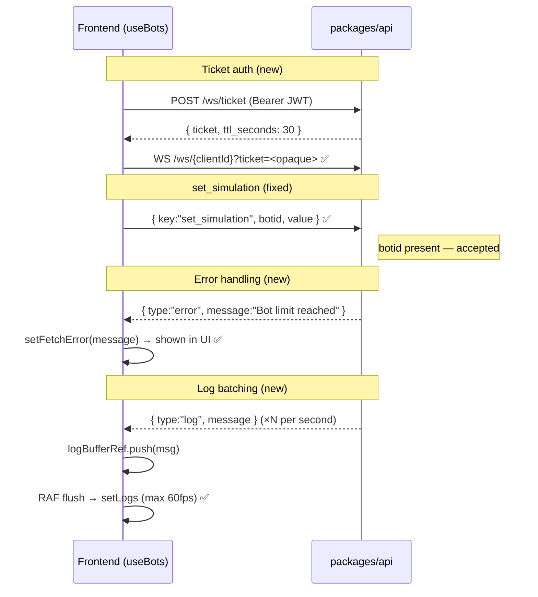

# Prompt 05 — Real-time Updates & WebSocket Integration

**Package:** `packages/web`  
**Prompt ID:** 05-WEB-REALTIME  
**Output File:** `docs/real-time/websocket-integration.md`  
**Reviewed:** July 2025 | **Updated:** July 2025 (post-implementation)

---

## Implementation Status

| Finding | Severity | Status |
|---|---|---|
| JWT in WebSocket query string | High | ✅ **Resolved** — `POST /ws/ticket` → `?ticket=<opaque>` |
| `set_simulation` missing `botid` | High | ✅ **Resolved** — `botid: selectedBotId` added; guard for null |
| `WsErrorEvent` not handled | High | ✅ **Resolved** — `case "error"` sets `fetchError` |
| `handleCreate` silent failure when disconnected | Medium | ✅ **Resolved** — checks `wsOpen`; shows error message |
| Stale `botIds` closure | Medium | ✅ **Resolved** — `botIdsRef` |
| Concurrent history fetch race condition | Medium | ⚠️ **Partial** — `botIdsRef` fixes stale list; concurrent fetch race remains low-risk |
| No timeout after `create` command | Medium | ⚠️ **Deferred** — no timeout implemented; noted as post-launch |
| `useBots` has no unit tests | Medium | ✅ **Resolved** — 20 tests covering all WS event types |
| Stale token on WS connect | Medium | ✅ **Resolved** — ticket fetched async before WS opens |
| `WsConnectedEvent` not handled | Low | ✅ **Resolved** — `WsErrorEvent` handled; connected/ping intentionally ignored |
| Log array spread per message | Low | ✅ **Resolved** — RAF batching |
| Bot limit error not surfaced | Low | ✅ **Resolved** — `WsErrorEvent` handler shows message |
| No MSW WebSocket mocking | Low | ⚠️ **Deferred** — MSW v2 `ws` handler not yet implemented |

---

## 1. WebSocket Architecture (updated)

### Authentication Flow
```
useBots mounts
  → fetchWsTicket() → POST /ws/ticket (Bearer JWT in header)
  → API returns { ticket: "<32-byte opaque>", ttl_seconds: 30 }
  → setWsUrl(`${WS}/${clientId}?ticket=${ticket}`)
  → useWebSocket(wsUrl) opens connection
  → JWT never appears in URL, server logs, or browser history ✅

Fallback (dev mode / no auth):
  → fetchWsTicket() returns null
  → Falls back to ?token= or no auth
```

### socketRef Cleanup (updated)
```ts
// useWebSocket.tsx — cleanup now uses ref, not async state updater
return () => {
    shouldReconnect.current = false;
    if (socketRef.current) {
        socketRef.current.close();
        socketRef.current = null;
    }
    setSocket(null);
    setWsOpen(false);
};
```

---

## 2. WebSocket Events (updated)

### Server → Client

| Event | Handler | Status |
|---|---|---|
| `connected` | Not handled (intentional) | ✅ Acceptable |
| `log` | RAF buffer → `setLogs` (max 60fps) | ✅ Optimised |
| `bot_created` | Fetch bot IDs → auto-run | ✅ |
| `bot_removed` | `dispatch({ type: "BOT_REMOVED" })` | ✅ |
| `order_success` | `fetchAllOrders(botIdsRef.current)` | ✅ Fixed stale closure |
| `trade_success` | `fetchAllTrades(botIdsRef.current)` | ✅ Fixed stale closure |
| `error` | `setFetchError(msg.message)` | ✅ **New** |
| `ping` | Not handled (intentional) | ✅ Acceptable |

### Client → Server

| Key | Fields | Status |
|---|---|---|
| `create` | — | ✅ |
| `run` | `botid` | ✅ |
| `remove` | `botid` | ✅ |
| `set_simulation` | `botid`, `value` | ✅ **Fixed** — `botid` now included |

---

## 3. Bot State Machine (updated)

```ts
type BotLifecycle = "idle" | "creating" | "running" | "removing" | "error";

// Dispatched on WS events:
case "bot_created": dispatch({ type: "BOT_CREATED" });
case "bot_removed": dispatch({ type: "BOT_REMOVED" });

// Dispatched on user actions:
handleCreate → dispatch({ type: "CREATE_REQUESTED" })
handleRemove → dispatch({ type: "REMOVE_REQUESTED" })
```

---

## 4. onmessage Error Handling (new)

```ts
socket.onmessage = async (event) => {
    try {
        const msg = parseMessage(event.data);
        // ... switch statement
    } catch {
        setFetchError("Unexpected error processing server message");
    }
};
```

Outer try/catch prevents unhandled promise rejections from async handlers.

---

## 5. Updated Sequence Diagram



---

## Remaining Open Items

| Item | Priority | Notes |
|---|---|---|
| Command timeout (create → bot_created) | Medium | No timeout if server never responds; deferred |
| Concurrent history fetch race | Low | Low-risk; deferred |
| MSW WebSocket integration tests | Low | MSW v2 `ws` handler not yet used |
