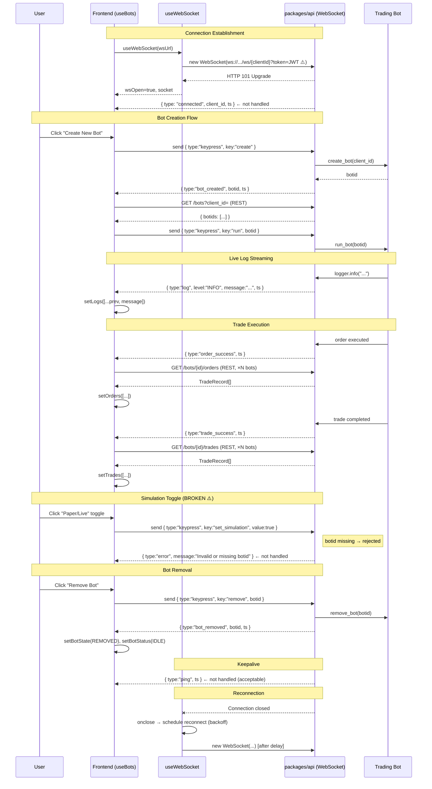

# Prompt 05 — Real-time Updates & WebSocket Integration

**Package:** `packages/web`  
**Prompt ID:** 05-WEB-REALTIME  
**Output File:** `docs/real-time/websocket-integration.md`  
**Reviewed:** July 2025  
**API Sources:** `packages/api` included — event schemas and server behaviour verified

---

## Executive Summary

The WebSocket integration is architecturally sound. `useWebSocket` is a clean, well-tested hook that handles connection lifecycle, exponential backoff reconnection, and cleanup correctly. `useBots` consumes it and maps server events to state updates in a readable switch statement.

The most significant issues are: the JWT is passed in the WebSocket URL query string (confirmed High severity from Prompt 02); the `set_simulation` command is sent without a `botid` and is silently rejected by the server; `WsErrorEvent`, `WsConnectedEvent`, and `WsPingEvent` from the server are not handled by the frontend; and the `onmessage` handler captures a stale `botIds` closure. These are all correctness bugs, not architectural problems.

The connection layer itself — reconnection logic, cleanup, backoff — is well-implemented and fully tested.

---

## 1. WebSocket Architecture

### Library

**Native browser `WebSocket` API** — no third-party library. This is the correct choice for a React application: zero bundle cost, full browser support, and sufficient for the message patterns used.

### Connection Setup

The WebSocket is instantiated inside `useWebSocket`, a custom hook that encapsulates the entire connection lifecycle:

```ts
// hooks/useWebSocket.tsx
const connect = (): void => {
    if (!shouldReconnect.current) return;
    const ws = new WebSocket(url);
    ws.onopen = () => { ... setSocket(ws); setWsOpen(true); };
    ws.onerror = () => { setWsError("WebSocket connection error — check server status"); };
    ws.onclose = () => { ... setTimeout(connect, delay); };
};
connect();
```

### Endpoint

```
ws://<VITE_WS_URL>/{clientId}?token=<JWT>
```

Resolved at runtime in `useBots`:
```ts
const wsUrl = token
    ? `${WS}/${clientId}?token=${encodeURIComponent(token)}`
    : `${WS}/${clientId}`;
```

The server endpoint is `{api_prefix}/ws/{client_id}` — confirmed in `packages/api/src/main.py`.

### Authentication

**JWT passed as query parameter** — the `?token=<JWT>` approach. This is the confirmed High-severity finding from Prompt 02. The API provides `POST /ws/ticket` for secure ticket-based auth; the frontend does not use it.

In dev mode (`VITE_DEV_AUTH_BYPASS=true`), `getAuthToken()` returns `"dev-token"`, which is sent as the token. The API's `verify_token` passes this through in dev mode (no `NETLIFY_SITE_URL` or `SONARFT_API_TOKEN` configured).

### Configuration

The WebSocket base URL is configurable via `VITE_WS_URL` environment variable, with a `ws://localhost:8000/api/v1/ws` fallback. Correct.

### Connection Count

**One WebSocket connection per `useBots` instance.** Since `useBots` is only called once (in `Bots`), and `Bots` is only rendered once on the `Crypto` page, there is effectively one WebSocket connection per authenticated session. The server-side `WebSocketManager` handles the case where a client reconnects by closing the existing connection before accepting the new one.

---

## 2. Connection Lifecycle

### Establishment

```
useBots renders
  → getAuthToken() called (render time)
  → wsUrl constructed
  → useWebSocket(wsUrl) called
    → useEffect fires
      → connect() called
        → new WebSocket(url)
        → ws.onopen → setWsOpen(true), setSocket(ws), reset attemptRef
```

### Reconnection & Exponential Backoff

`useWebSocket` implements exponential backoff reconnection:

```ts
const BACKOFF_BASE_MS = 1000;
const BACKOFF_MAX_MS = 30000;

ws.onclose = () => {
    setWsOpen(false);
    setSocket(null);
    if (autoReconnect && shouldReconnect.current) {
        const delay = Math.min(
            BACKOFF_BASE_MS * Math.pow(2, attemptRef.current),
            BACKOFF_MAX_MS
        );
        attemptRef.current += 1;
        setTimeout(connect, delay);
    }
};
```

Backoff schedule:

| Attempt | Delay |
|---|---|
| 1 | 1s |
| 2 | 2s |
| 3 | 4s |
| 4 | 8s |
| 5 | 16s |
| 6+ | 30s (capped) |

`attemptRef` is reset to 0 on successful connection (`ws.onopen`). This is correct — the counter only accumulates during a failure streak.

### Cleanup

```ts
return () => {
    shouldReconnect.current = false;          // prevents reconnect after unmount
    setSocket((currentSocket) => {
        if (currentSocket) currentSocket.close();
        return null;
    });
    setWsOpen(false);
};
```

The cleanup uses the functional `setSocket` updater to access the current socket reference without adding it to the dependency array — a correct pattern that avoids a stale closure on the socket. `shouldReconnect.current = false` is set before closing, ensuring the `onclose` handler does not schedule a reconnect after unmount.

**Fully tested:** `useWebSocket.test.tsx` covers connection, error, cleanup (no reconnect after unmount), socket close on unmount, and exponential backoff.

### URL Change Handling

The `useEffect` in `useWebSocket` depends on `[url, autoReconnect]`. If the URL changes (e.g., token refreshes), the effect re-runs: `shouldReconnect.current` is reset to `true`, `attemptRef` is reset to `0`, and a new connection is established. The old socket is closed in the cleanup.

**Gap:** As noted in Prompt 02, `getAuthToken()` is called once at `useBots` render time to build the URL. If the user logs in after `useBots` has already mounted (e.g., auth state loads asynchronously), the URL is built without a token and the WebSocket connects unauthenticated. The URL does not update when auth state changes because `useBots` does not re-render in response to auth changes — it only reads `getAuthToken()` once.

---

## 3. WebSocket Events

### Server → Client Events (confirmed against `packages/api/src/models/schemas.py`)

| Event type | Payload fields | Handler in `useBots` | Frequency | State update |
|---|---|---|---|---|
| `connected` | `client_id: str`, `ts: int` | ❌ Not handled | Once per connection | None |
| `log` | `level: str`, `message: str`, `ts: int` | ✅ Appends to `logs` | High (every bot log line) | `setLogs` (capped at 500) |
| `bot_created` | `botid: str \| null`, `ts: int` | ✅ Fetches bot IDs, auto-runs | Low (on create) | `setBotIds`, `setSelectedBotId`, `setBotStatus` |
| `bot_removed` | `botid: str \| null`, `ts: int` | ✅ Resets state | Low (on remove) | `setBotState(REMOVED)`, `setBotStatus(IDLE)` |
| `order_success` | `ts: int` | ✅ Fetches all orders | Medium (per order) | `setOrders` |
| `trade_success` | `ts: int` | ✅ Fetches all trades | Medium (per trade) | `setTrades` |
| `error` | `message: str`, `ts: int` | ❌ Not handled | On server-side errors | None |
| `ping` | `ts: int` | ❌ Not handled | Every 30s (keepalive) | None |

### Client → Server Commands (confirmed against `packages/api/src/websocket/manager.py`)

| Key | Additional fields | Sent from | Server action |
|---|---|---|---|
| `create` | — | `handleCreate` | Creates a new bot, emits `bot_created` |
| `run` | `botid: str` | Auto-sent after `bot_created` | Starts the bot |
| `remove` | `botid: str` | `handleRemove` | Removes bot, emits `bot_removed` |
| `set_simulation` | `botid: str`, `value: bool` | `handleToggleSimulation` | Sets simulation mode on bot |

### Critical Gap — `set_simulation` Missing `botid`

The frontend sends:
```ts
socket.send(JSON.stringify({ type: "keypress", key: "set_simulation", value: next }));
```

The server requires `botid` for this command:
```python
elif key == "set_simulation":
    if not botid or not _BOTID_RE.match(str(botid)):
        await self._push_model(client_id, WsErrorEvent(
            message="Invalid or missing botid", ts=int(time.time()),
        ))
```

The server responds with a `WsErrorEvent`. The frontend has no handler for `type: "error"` events — the error is silently dropped. **Simulation mode toggle is broken in production.**

### Unhandled Server Events

**`connected`:** The server sends this immediately after accepting the WebSocket connection. The frontend ignores it. This event could be used to confirm the connection is authenticated and ready, and to display a "Connected" status more reliably than relying on `wsOpen` state alone.

**`ping`:** The server sends a ping every 30 seconds (`_WS_KEEPALIVE_INTERVAL`) when the send queue is idle. The frontend ignores it. This is acceptable — the ping is a server-side keepalive to prevent proxy timeouts, not a request for a client response.

**`error`:** The server sends structured error events for invalid commands, bot limit exceeded, and operation failures. The frontend ignores all of them. Users receive no feedback when server-side operations fail.

---

## 4. Real-time Data Integration

### Message Parsing

All incoming messages go through `parseMessage`:

```ts
const parseMessage = (raw: string): WsMessage => {
    try {
        const msg = JSON.parse(raw) as WsMessage;
        if (msg && typeof msg.type === "string") return msg;
    } catch { /* not JSON */ }
    return { type: "log", level: "INFO", message: raw };
};
```

**Strengths:**
- Handles non-JSON messages gracefully (falls back to treating as a log line)
- Type guard checks `typeof msg.type === "string"` before accepting

**Gaps:**
- No validation of payload fields beyond `type`. A `bot_created` event with a missing `botid` field will not be caught — `msg.botid` will be `undefined`, and `ids[ids.length - 1]` will still be used as the selected bot ID.
- No schema validation (e.g., Zod) — the cast `as WsMessage` is a TypeScript assertion, not a runtime check.
- The `ts` field (timestamp) is present in all server events but never used by the frontend — it could be used for event ordering or deduplication.

### Data Merging Strategy

**Replace, not merge.** On `order_success` and `trade_success`, the entire history array is replaced:
```ts
setOrders(await fetchAllOrders(botIds));
setTrades(await fetchAllTrades(botIds));
```

This is simple and correct for the current use case. The trade-off is a full REST round-trip on every event.

### Stale `botIds` Closure

As documented in Prompt 03, the `onmessage` handler captures `botIds` from the closure at effect registration time:

```ts
useEffect(() => {
    if (!wsOpen || !socket) return;
    socket.onmessage = async (event) => {
        // ...
        case "order_success":
            setOrders(await fetchAllOrders(botIds));  // ← stale closure
```

The effect re-runs when `botIds` changes (it is in the dependency array), but there is a window between the state update and the effect re-run where the stale value is active. If `order_success` fires during this window, history is fetched for the wrong bot list.

### Event Ordering

No explicit ordering guarantee. WebSocket messages are processed sequentially by the browser's event loop — `onmessage` fires in order. However, the async handlers (`getBotIds`, `fetchAllOrders`) introduce non-determinism: if two `order_success` events arrive in quick succession, both trigger `fetchAllOrders` concurrently, and the second response may arrive before the first, causing the older data to overwrite the newer.

### Deduplication

No deduplication. Duplicate events (e.g., two `bot_created` events) would cause two `getBotIds` fetches and two `socket.send({ key: "run" })` commands — potentially starting the bot twice.

---

## 5. Error Handling & Resilience

### Connection Errors

`ws.onerror` sets a user-visible error string:
```ts
ws.onerror = () => {
    setWsError("WebSocket connection error — check server status");
};
```

`Bots.tsx` renders this:
```tsx
{wsError && <div className="bots-ws-error">⚠ {wsError} — reconnecting...</div>}
```

The error message is shown immediately on connection failure. The "reconnecting..." suffix is always appended regardless of whether `autoReconnect` is true — minor inaccuracy if reconnection is disabled.

**Gap:** `wsError` is set on `onerror` but is never cleared on `onclose`. If the connection closes cleanly (server restart), `wsError` remains `null` and the user only sees the WS status badge change from "Connected" to "Disconnected". If the connection closes with an error, `wsError` is set and persists until the next successful `onopen` (which clears it). This is correct behaviour.

### Parse Errors

`parseMessage` catches `JSON.parse` exceptions and falls back to treating the raw string as a log message. This prevents the message handler from crashing on malformed input.

### Server-side Operation Errors

**Not handled.** The server sends `WsErrorEvent` for:
- Invalid/missing `botid` on `run`, `remove`, `set_simulation`
- Bot limit exceeded on `create`
- Bot creation/run/removal failures

All of these are silently dropped by the frontend. The user has no way to know that an operation failed.

### Graceful Degradation

If the WebSocket is unavailable:
- The bot list is still loaded via REST on mount
- Parameters and indicators are still configurable via REST
- The Create/Remove/Run buttons are disabled when `wsOpen` is false (via `BotControls` disabled logic)
- The user sees the "Disconnected" status badge and the error message

This is reasonable degradation — the read-only parts of the UI remain functional.

**Gap:** The `handleCreate` and `handleToggleSimulation` callbacks do not check `wsOpen` before calling `socket.send`. If `socket` is `null` (disconnected), the optional chaining (`socket?.send(...)`) silently does nothing. The user clicks "Create New Bot" and nothing happens — no feedback.

```ts
const handleCreate = useCallback(() => {
    if (socket) {
        socket.send(JSON.stringify({ type: "keypress", key: "create" }));
        setBotState(BotState.REMOVED);
    }
    // ← no else branch: silent failure if socket is null
}, [socket]);
```

`BotControls` disables the Create button when `botState !== BotState.REMOVED`, but `botState` starts as `REMOVED` — so the Create button is enabled even when disconnected. Only the Remove button checks `wsOpen`.

### Timeout

No message-level timeout. If the server accepts the WebSocket connection but never sends a `bot_created` event after a `create` command, the UI waits indefinitely with no feedback.

---

## 6. Performance

### Message Frequency

| Event type | Expected frequency |
|---|---|
| `log` | High — every bot log line (potentially multiple per second during active trading) |
| `ping` | Low — every 30 seconds |
| `order_success` | Medium — once per executed order |
| `trade_success` | Medium — once per completed trade |
| `bot_created` / `bot_removed` | Very low — manual user actions |

The `log` event is the high-frequency path. Each log message triggers:
1. `parseMessage` (JSON parse)
2. `setLogs` functional updater (array spread + slice)
3. React re-render of `Bots` → `BotConsole`
4. `BotConsole` `useEffect` (scroll check)

For a bot emitting 10 log lines per second, this is 10 React re-renders per second of the `Bots` subtree. This is manageable but not optimal.

### Log Array Spread

```ts
setLogs((prev) => {
    const next = [...prev, msg.message ?? ""];
    return next.length > MAX_LOG_LINES ? next.slice(-MAX_LOG_LINES) : next;
});
```

Every log message creates a new array via spread. At 500 lines (the cap), each update allocates a 500-element array. This is acceptable for the current scale but would benefit from a ring buffer or batched flush approach for high-frequency bots.

### REST Fetches Triggered by WS Events

`order_success` and `trade_success` each trigger `Promise.all` over all bot IDs:
```ts
setOrders(await fetchAllOrders(botIds));  // N parallel GET requests
```

With 5 bots (the server limit), this is 5 parallel requests per event. If events arrive faster than the requests complete, multiple concurrent fetch batches will be in flight simultaneously. The last one to resolve wins — potentially overwriting newer data with older data (race condition).

### Re-render Impact

Each WS event causes at minimum one `setState` call, which triggers a re-render of `useBots`'s consumer (`Bots`) and all its children. Since `BotControls`, `BotConsole`, and `TradeHistoryTable` are not wrapped in `React.memo`, they all re-render on every state change regardless of whether their props changed.

For `log` events (high frequency), `TradeHistoryTable` and `ProfitChart` re-render on every log line even though their data (`orders`, `trades`) has not changed.

### Payload Size

WS messages are small JSON objects. Log messages are the largest — a single log line with level, message, and timestamp. No binary frames, no compression. Payload size is not a concern at current scale.

### Throttling / Batching

No throttling or batching of WS message handling. Each message is processed immediately on receipt. For the current message frequency this is fine.

---

## 7. Testing & Mocking

### `useWebSocket` Tests

`useWebSocket.test.tsx` provides comprehensive coverage:

| Test scenario | Covered |
|---|---|
| Opens connection on mount | ✅ |
| Sets `wsOpen = true` on `onopen` | ✅ |
| Sets `wsOpen = false` on `onclose` | ✅ |
| Returns socket instance after open | ✅ |
| Sets `wsError` on `onerror` | ✅ |
| Clears `wsError` on successful reconnect | ✅ |
| Does NOT reconnect after unmount | ✅ |
| Closes socket on unmount | ✅ |
| Reconnects after close (autoReconnect=true) | ✅ |
| Does NOT reconnect (autoReconnect=false) | ✅ |
| Exponential backoff timing | ✅ |

Mock strategy: `vi.stubGlobal("WebSocket", vi.fn(() => mockWsInstance))` — replaces the global `WebSocket` constructor with a mock that returns a controllable object. `vi.useFakeTimers()` controls backoff timing. This is the correct approach.

### `useBots` Tests

**No tests exist for `useBots`.** This is the highest-priority testing gap. The hook's WS message handling, bot lifecycle state transitions, and REST fetch triggers are all untested.

A `useBots` test would need to:
- Mock `useWebSocket` to return a controllable `socket`
- Mock `getBotIds`, `fetchAllOrders`, `fetchAllTrades`
- Simulate `socket.onmessage` calls with each event type
- Assert state transitions

### Integration Tests

`workflows.test.tsx` tests `Parameters` and `Indicators` via MSW but does not test any WebSocket behaviour. No integration test exercises the bot creation flow or WS event handling.

### MSW WebSocket Support

MSW v2 (used in this project) has experimental WebSocket support (`ws` from `msw`). It is not currently used — the mock layer only covers REST endpoints. Adding WS mocking would enable integration tests for the full bot lifecycle flow.

---

## 8. Real-time Features Using WebSocket

### Feature: Bot Lifecycle Management

**Events used:** `bot_created`, `bot_removed`  
**Data flow:**
```
User clicks "Create" → socket.send({ key: "create" })
  → Server creates bot → emits bot_created { botid, ts }
  → Frontend: getBotIds() → setSelectedBotId → setBotIds → setBotStatus(RUNNING)
  → socket.send({ key: "run", botid })
  → Bot starts trading
```
```
User clicks "Remove" → window.confirm → socket.send({ key: "remove", botid })
  → Server removes bot → emits bot_removed { botid, ts }
  → Frontend: setBotState(REMOVED) → setBotStatus(IDLE)
```

**Issues:** `bot_created` auto-runs the bot immediately without user confirmation. If `getBotIds` fails, the bot is created but never started. No timeout if `bot_created` never arrives.

### Feature: Live Log Streaming

**Events used:** `log`  
**Data flow:**
```
Bot executes → Python logger emits record
  → WsLogHandler.emit() → queue.put_nowait({ type: "log", level, message, ts })
  → _send_loop drains queue → websocket.send_text(json)
  → Frontend parseMessage → setLogs (append + cap at 500)
  → BotConsole re-renders → auto-scrolls to bottom
```

This is the most active real-time feature. The log stream gives the user visibility into bot activity in near-real-time.

### Feature: Trade & Order Notifications

**Events used:** `order_success`, `trade_success`  
**Data flow:**
```
Bot executes order/trade → server emits order_success / trade_success { ts }
  → Frontend: fetchAllOrders(botIds) / fetchAllTrades(botIds)
  → setOrders / setTrades
  → TradeHistoryTable + ProfitChart re-render
```

Note: the event payload contains only `ts` — no order/trade data. The frontend must make a REST round-trip to get the actual data. This is a deliberate design choice (single source of truth in the REST API), but it means there is always a latency gap between the event and the UI update.

### Feature: Simulation Mode Toggle

**Events used:** `set_simulation` (client → server)  
**Status: Broken** — `botid` is not included in the message. Server rejects with `WsErrorEvent`. Frontend does not handle `WsErrorEvent`. User sees no feedback.

### Feature: Connection Status Display

**Events used:** WS `onopen` / `onclose` / `onerror`  
**Data flow:**
```
ws.onopen → setWsOpen(true) → Bots renders "● Connected" badge
ws.onclose → setWsOpen(false) → Bots renders "○ Disconnected" badge
ws.onerror → setWsError(...) → Bots renders error banner
```

This is correctly implemented and gives the user clear connection status feedback.

---

## 9. Debugging & Monitoring

### Logging

No WebSocket events are logged to the console by the frontend. In development, the browser's Network tab (WS filter) shows all frames. There is no application-level WS event logging.

### DevTools

The browser's built-in WebSocket inspector (Network tab → WS) shows all frames in both directions. This is sufficient for debugging during development.

### Metrics

No connection metrics are tracked (connection count, reconnect attempts, message count, latency). `attemptRef.current` tracks the backoff attempt count but is not exposed or logged.

### Error Reporting

No WS errors are sent to an error reporting service. `wsError` state is displayed to the user but not logged or reported externally.

---

## 10. Comparison with REST API

### Why WebSocket for Bot Lifecycle?

The bot lifecycle (create, run, remove) is driven by WebSocket commands rather than REST endpoints. The API does expose REST equivalents (`POST /bots`, `POST /bots/{id}/run`, `DELETE /bots/{id}`), but the frontend does not use them. The WebSocket approach is justified because:

1. **Bidirectional confirmation** — the server can push `bot_created` / `bot_removed` events back to the client without polling
2. **Log streaming** — the same connection streams log lines, which cannot be done efficiently over REST
3. **Low latency** — bot commands are acknowledged immediately without HTTP overhead

### Why REST for History Data?

Order and trade history is fetched via REST on demand (triggered by WS events). This is correct — history data is persistent, paginated, and does not need to be streamed. The WS event is the trigger; REST is the authoritative data source.

### Bandwidth Comparison

| Approach | Bot lifecycle | Log streaming | History |
|---|---|---|---|
| Current (WS + REST) | WS commands + events | WS log frames | REST on-demand |
| Pure REST polling | POST/DELETE + polling | Long-poll or SSE | REST on-demand |

The current hybrid approach is more efficient than pure REST polling for log streaming and lifecycle events. The complexity cost is justified.

### Fallback Behaviour

If WebSocket is unavailable:
- Bot list is loaded via REST ✅
- Config (parameters/indicators) is loaded via REST ✅
- Bot create/run/remove is **not possible** — no REST fallback for WS commands ⚠️
- Log streaming is **not possible** — no REST fallback ⚠️

The application degrades gracefully for read operations but loses all bot control capability without WebSocket.

---

## 11. Data Consistency

### Race Condition: Concurrent History Fetches

When `order_success` or `trade_success` events arrive in rapid succession:

```
Event 1 arrives → fetchAllOrders() starts (async)
Event 2 arrives → fetchAllOrders() starts (async)
Response 2 arrives first → setOrders(data2)
Response 1 arrives second → setOrders(data1)  ← overwrites newer data with older
```

Both responses contain the same data (full history), so in practice the overwrite is harmless — but it is a structural race condition. The correct fix is to use a sequence number or `AbortController` to cancel the previous in-flight request when a new event arrives.

### Race Condition: `bot_created` → `getBotIds` → `run`

```
bot_created event arrives
  → getBotIds() starts (async)
  → [gap: server processes another request]
  → getBotIds() resolves → ids = [...]
  → socket.send({ key: "run", botid: ids[ids.length - 1] })
```

If `getBotIds` is slow or returns an unexpected list, the wrong bot may be started. This is low probability but possible.

### REST vs WebSocket State Sync

The application uses a clear separation: WebSocket for events, REST for data. State is only updated from REST responses (authoritative) triggered by WS events (notifications). There is no case where WS event payload data is written directly to state — the `botid` from `bot_created` is used only to select the bot, not to update the bot list (which is re-fetched via REST). This is a sound consistency model.

### Stale `botIds` in `onmessage` Closure

Documented in Prompts 02, 03, and confirmed here. The `botIds` value captured in the `onmessage` closure may be stale for a brief window after a new bot is created. The effect re-runs when `botIds` changes, but the window exists.

---

## 12. Scalability

### Connection Pooling

Not applicable — one WebSocket connection per client session. The server's `WebSocketManager` stores one connection per `client_id` in a dict. If the same client opens a second connection (e.g., two browser tabs), the server closes the first connection before accepting the second.

### Message Ordering

WebSocket frames are delivered in order by the protocol. The browser's `onmessage` handler fires in order. However, async handlers (`getBotIds`, `fetchAllOrders`) break ordering — the responses may arrive out of order.

### Backpressure

The server uses an `asyncio.Queue(maxsize=1000)` per client. If the frontend is slow to consume messages (e.g., tab is backgrounded), the queue fills and new events are dropped with a warning log. The frontend has no mechanism to signal backpressure or detect dropped messages.

### Bot Limit

The server enforces `max_bots_per_client = 5`. If the limit is reached, the server sends a `WsErrorEvent` ("Bot limit reached (5)"). The frontend does not handle this event — the user sees no feedback when the Create button is clicked and the limit is already reached.

---

## 13. WebSocket Integration Diagram



---

## Findings Summary

| # | Finding | Severity | File |
|---|---|---|---|
| 1 | JWT passed as WebSocket query parameter — exposed in server logs and browser history | High | `hooks/useBots.ts` |
| 2 | `set_simulation` command missing `botid` — server rejects, frontend silently drops error | High | `hooks/useBots.ts` |
| 3 | `WsErrorEvent` not handled — all server-side operation failures are silently dropped | High | `hooks/useBots.ts` |
| 4 | `handleCreate` does not check `wsOpen` — silent failure when disconnected | Medium | `hooks/useBots.ts` |
| 5 | Stale `botIds` closure in `onmessage` — history fetched for wrong bot list after creation | Medium | `hooks/useBots.ts` |
| 6 | Concurrent history fetches race condition — older response can overwrite newer data | Medium | `hooks/useBots.ts` |
| 7 | No timeout after sending `create` command — UI waits indefinitely if `bot_created` never arrives | Medium | `hooks/useBots.ts` |
| 8 | `useBots` has no unit tests — WS message handling entirely untested | Medium | `hooks/useBots.ts` |
| 9 | Stale token on WS connect — `getAuthToken()` called at render time, not reactive to auth changes | Medium | `hooks/useBots.ts` |
| 10 | `WsConnectedEvent` not handled — connection readiness relies on `wsOpen` state alone | Low | `hooks/useBots.ts` |
| 11 | Log array spread on every message — GC pressure at high log frequency | Low | `hooks/useBots.ts` |
| 12 | Bot limit exceeded error (`WsErrorEvent`) not surfaced to user | Low | `hooks/useBots.ts` |
| 13 | No MSW WebSocket mocking — integration tests cannot exercise WS event flows | Low | `src/mocks/` |

---

## Recommendations

**Priority 1 — Fix before production**

1. **Fix `set_simulation` command** — include `selectedBotId` in the message:
   ```ts
   socket?.send(JSON.stringify({
       type: "keypress", key: "set_simulation",
       botid: selectedBotId, value: next
   }));
   ```

2. **Handle `WsErrorEvent`** — add a `case "error"` branch that sets a visible error state:
   ```ts
   case "error":
       setFetchError(msg.message ?? "Server error");
       break;
   ```

3. **Implement WS ticket auth** — call `POST /ws/ticket` before opening the WebSocket, use `?ticket=<value>` instead of `?token=<JWT>`.

**Priority 2 — Correctness**

4. **Fix `handleCreate` silent failure** — check `wsOpen` and show an error if disconnected:
   ```ts
   const handleCreate = useCallback(() => {
       if (!socket || !wsOpen) {
           setFetchError("Cannot create bot — not connected");
           return;
       }
       socket.send(...);
   }, [socket, wsOpen]);
   ```

5. **Fix stale `botIds` closure** — use a ref:
   ```ts
   const botIdsRef = useRef(botIds);
   useEffect(() => { botIdsRef.current = botIds; }, [botIds]);
   // use botIdsRef.current inside onmessage
   ```

6. **Fix concurrent fetch race** — use a sequence counter or `AbortController` to cancel previous in-flight history fetches when a new event arrives.

7. **Add command timeout** — after sending `create`, set a 10-second timeout that shows an error if `bot_created` is not received.

**Priority 3 — Quality**

8. **Write `useBots` unit tests** — mock `useWebSocket` and test each WS event handler branch.

9. **Add MSW WebSocket mocking** — use MSW v2's `ws` handler to enable integration tests for the bot lifecycle flow.

10. **Batch log updates** — accumulate log lines in a ref and flush to state on a `requestAnimationFrame` or 100ms interval to reduce re-render frequency at high log volumes.
