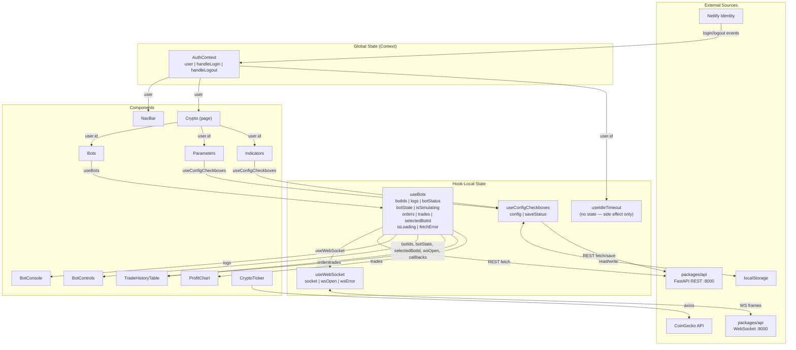

# Prompt 03 — State Management & Data Flow

**Package:** `packages/web`  
**Prompt ID:** 03-WEB-STATE  
**Output File:** `docs/state-management/data-flow.md`  
**Reviewed:** July 2025  
**API Sources:** `packages/api` included — schema alignment verified

---

## Executive Summary

sonarftweb uses a deliberately minimal state management approach: React Context API for auth, `useState` in custom hooks for all feature state, and `localStorage` for config persistence. This is appropriate for the application's current scope. There is no Redux store despite the full Redux Toolkit stack being installed — a dead dependency that should be removed.

The state design is generally clean. The main structural concerns are: `useBots` manages too many independent state slices in a single hook (bot lifecycle, WebSocket, trade history, simulation mode); `useConfigCheckboxes` has a suppressed exhaustive-deps warning that creates a real stale-closure risk; and the `AuthContext` value object is correctly memoized but the context is consumed by components that only need a subset of its value, causing unnecessary re-renders on any auth state change.

No state mutations, no circular state dependencies, and no prop drilling beyond one level were found.

---

## 1. State Management Overview

| Mechanism | Used for | Location |
|---|---|---|
| `useState` in custom hooks | Bot lifecycle, WS connection, trade history, config forms | `useBots`, `useWebSocket`, `useConfigCheckboxes` |
| `useState` in components | Crypto ticker prices | `CryptoTicker` |
| React Context API | Auth user, login/logout handlers | `AuthProvider` / `AuthContext` |
| `localStorage` | Config form state (parameters, indicators) | `useConfigCheckboxes` |
| URL / route state | None | — |
| `sessionStorage` | None | — |
| Redux / Zustand / Recoil | **Installed but not used** | `package.json` only |
| Server cache | None — no caching layer | — |

### Global vs Local State

| State | Scope | Rationale |
|---|---|---|
| `user` (auth) | Global (Context) | Needed by NavBar, Crypto page, API calls |
| `botIds`, `logs`, `botStatus`, `orders`, `trades` | Hook-local (`useBots`) | Scoped to the Bots component tree |
| `config` (parameters/indicators) | Hook-local (`useConfigCheckboxes`) | Scoped to each config form component |
| `wsOpen`, `wsError`, `socket` | Hook-local (`useWebSocket`) | Encapsulated connection state |
| `cryptoData` | Component-local (`CryptoTicker`) | Isolated display data |

---

## 2. Global State Inventory

### AuthContext

The only global state container in the application.

| State Name | Type | Purpose | Data | Updated From |
|---|---|---|---|---|
| `user` | `NetlifyUser \| null` | Authenticated user identity | `{ id, email, token }` | Netlify Identity `login`/`logout` events |
| `handleLogin` | `() => void` | Opens Netlify Identity modal | — | Stable `useCallback` |
| `handleLogout` | `() => void` | Logs out and clears user | — | Stable `useCallback` |

**Provider placement:** `AuthProvider` wraps the entire app at the root (`App.tsx`), above the Router. This is correct — auth state must be available to both the NavBar (outside routes) and page components (inside routes).

**Context value memoization:** The context value is correctly memoized with `useMemo`:
```ts
const contextValue = useMemo<AuthContextValue>(
    () => ({ user, handleLogin, handleLogout }),
    [user, handleLogin, handleLogout]
);
```
This prevents unnecessary re-renders of consumers when the `AuthProvider` re-renders for unrelated reasons. `handleLogin` and `handleLogout` are stable `useCallback` references, so the context value only changes when `user` changes — correct.

**Redux Store:** No store exists. `@reduxjs/toolkit`, `react-redux`, `reselect`, `use-sync-external-store`, and `immer` are all installed but unused.

---

## 3. Data Flow Analysis

### Bot Management Flow

```
useBots(user.id)
  │
  ├── MOUNT: getBotIds(clientId) → REST GET /bots
  │     └── setBotIds([...])
  │
  ├── WS CONNECT: useWebSocket(wsUrl)
  │     └── socket, wsOpen, wsError
  │
  ├── WS EVENT: bot_created
  │     ├── getBotIds() → REST GET /bots (refresh)
  │     ├── setSelectedBotId(lastId)
  │     ├── setBotIds([...])
  │     ├── setBotStatus(RUNNING)
  │     └── socket.send({ key: "run", botid })
  │
  ├── WS EVENT: bot_removed
  │     ├── setBotState(REMOVED)
  │     └── setBotStatus(IDLE)
  │
  ├── WS EVENT: order_success
  │     └── fetchAllOrders(botIds) → REST GET /bots/{id}/orders (×N)
  │           └── setOrders([...])
  │
  └── WS EVENT: trade_success
        └── fetchAllTrades(botIds) → REST GET /bots/{id}/trades (×N)
              └── setTrades([...])
```

**Data origin:** REST API (initial load, history) + WebSocket (lifecycle events, log lines)  
**Persistence:** None — all state is in-memory, lost on page reload  
**Update mechanism:** WebSocket events trigger REST re-fetches for history data

### Indicators / Parameters Flow

```
useConfigCheckboxes({ clientId, storageKey, fetchFn, ... })
  │
  ├── INIT (synchronous): localStorage.getItem(storageKey) → setConfig(stored)
  │
  ├── MOUNT (async, priority order):
  │     1. fetchFn(clientId) → REST GET /indicators or /parameters
  │     2. localStorage fallback (if fetch fails)
  │     3. defaultFn() → REST GET /indicators/defaults or /parameters/defaults
  │           └── falls back to bundled JSON if that also fails
  │
  ├── CHECKBOX CHANGE:
  │     ├── setConfig(next)
  │     └── localStorage.setItem(storageKey, JSON.stringify(next))
  │
  └── SAVE:
        ├── setSaveStatus("saving")
        ├── updateFn(clientId, config) → REST PUT /indicators or /parameters
        └── setSaveStatus("saved" | "error")
```

**Data origin:** REST API → localStorage → bundled JSON (three-tier fallback)  
**Persistence:** `localStorage` — survives page reload  
**Update mechanism:** Checkbox changes write to both state and localStorage simultaneously

### Auth Flow

```
AuthProvider mounts
  │
  ├── DEV_AUTH_BYPASS=true → setUser(DEV_USER) immediately
  │
  └── Production:
        ├── netlifyIdentity.init()
        ├── netlifyIdentity.currentUser() → setUser(existing session)
        ├── on("login") → setUser(user)
        └── on("logout") → setUser(null)
              └── useIdleTimeout(handleLogout, 30min, !!user)
```

**Data origin:** Netlify Identity widget (in-memory + its own storage)  
**Persistence:** Managed by Netlify Identity internally  
**Update mechanism:** Event listeners on the Netlify Identity widget

### Real-time Prices (CryptoTicker)

```
CryptoTicker mounts
  ├── fetchData() → axios GET CoinGecko /coins/markets → GET /simple/price
  │     └── setCryptoData([...])
  └── setInterval(fetchData, 180_000)  // every 3 minutes
```

**Data origin:** CoinGecko public API (external, unauthenticated)  
**Persistence:** None — component-local state  
**Note:** This data is entirely independent of the sonarft trading engine

---

## 4. Component Props Analysis

### Prop Drilling Depth

Maximum prop drilling depth: **1 level** (from `Bots` to its children).

```
Crypto (page)
  └── Bots (user.id → useBots internally)
        ├── BotControls (botIds, botState, selectedBotId, wsOpen, callbacks)
        ├── BotConsole (logs)
        ├── TradeHistoryTable (rows)
        └── ProfitChart (trades)
```

`Crypto` passes `user` to `Bots`. `Bots` calls `useBots(user.id)` and distributes the results to its children. No component receives props it doesn't use. No prop drilling beyond one level.

`Parameters` and `Indicators` receive only `clientId: string` — minimal and correct.

### Props Interface Quality

All props are typed with inline TypeScript interfaces. No `any` types in props. No PropTypes (correct given TypeScript strict mode).

**Minor concern — `BotsProps` type:**
```ts
interface BotsProps {
    user: AuthContextValue["user"] & { id: string };
}
```
The `& { id: string }` intersection is a workaround for `user.id` potentially being undefined in the base type. A cleaner approach would be to define a `AuthenticatedUser` type in `AuthProvider` that guarantees `id` is present, and use that as the prop type.

**Minor concern — `PrivateRoute` value prop:**
```ts
interface PrivateRouteProps {
    children: React.ReactNode;
    value: unknown;
}
```
`value: unknown` is overly broad. Since `PrivateRoute` only checks truthiness, this is functionally fine, but it loses type information at the call site.

---

## 5. Context Usage

### AuthContext

**Consumers:**

| Component | Values consumed | Re-renders when |
|---|---|---|
| `NavBar` | `user`, `handleLogin`, `handleLogout` | `user` changes |
| `Crypto` (page) | `user` | `user` changes |

Only two components consume `AuthContext`. Both need `user`, so there is no over-consumption. The context is not split (e.g., separate `UserContext` and `AuthActionsContext`) — given only two consumers, splitting is not necessary.

**Re-render analysis:** `AuthContext` value changes only when `user` changes (login/logout/idle timeout). This is infrequent. The `useMemo` on the context value is correctly applied. No unnecessary re-render risk from context.

**Context default value:**
```ts
export const AuthContext = createContext<AuthContextValue>({
    user: null,
    handleLogin: () => {},
    handleLogout: () => {},
});
```
The default value is a no-op fallback for components rendered outside `AuthProvider`. This is correct — it prevents runtime errors if a consumer is accidentally rendered without the provider.

---

## 6. Reducer Patterns

No `useReducer` or Redux reducers are used anywhere in the codebase. All state updates use `useState` setters directly.

**Assessment:** For the current complexity level this is appropriate. `useBots` manages 10 independent state slices with `useState`, which is the main candidate for a `useReducer` refactor if the bot lifecycle state machine grows more complex.

The bot status transitions form an implicit state machine:

```
IDLE → (create) → RUNNING → (remove) → IDLE
                           → (error)  → ERROR
```

This is currently managed with separate `botState` (number) and `botStatus` (string) variables, which can get out of sync. A `useReducer` with explicit action types would make the transitions explicit and prevent invalid states.

---

## 7. API Data Management

### Normalization

API data is stored as flat arrays — no normalization into ID-keyed maps:
```ts
const [orders, setOrders] = useState<TradeRecord[]>([]);
const [trades, setTrades] = useState<TradeRecord[]>([]);
const [botIds, setBotIds] = useState<string[]>([]);
```

For the current data volumes (≤100 records per fetch, ≤5 bots) this is fine. If the application scales to thousands of records, array lookups would become a performance concern.

### Cache Invalidation

No caching layer exists — every fetch returns fresh data. Cache invalidation is therefore not a concern. The trade-off is more network requests, which is acceptable for a trading application where data freshness is critical.

### Optimistic Updates

No optimistic updates. All state changes wait for server confirmation (WebSocket event or REST response). This is the correct conservative approach for financial data.

### Loading / Error State Coverage

| Operation | Loading state | Error state |
|---|---|---|
| Initial bot list | `isLoading` ✅ | `fetchError` ✅ |
| Config fetch (parameters/indicators) | ❌ None | Falls back silently ⚠️ |
| Config save | `saveStatus="saving"` ✅ | `saveStatus="error"` ✅ |
| Order/trade history fetch | ❌ None | Silent null return ⚠️ |
| Bot create/remove (WS) | ❌ None | ❌ None |

### State Duplication

**Confirmed duplication — `botIds` used stale in WS handler:**

```ts
// useBots.ts
const [botIds, setBotIds] = useState<string[]>([]);

useEffect(() => {
    if (!wsOpen || !socket) return;
    socket.onmessage = async (event) => {
        // ...
        case "order_success":
            setOrders(await fetchAllOrders(botIds));  // ← captures botIds from closure
```

The `botIds` value captured in the `onmessage` closure is the value at the time the effect ran, not the current value. If `botIds` changes (a new bot is created), the `order_success` handler will fetch orders for the old list. The `useEffect` dependency array includes `botIds`, so the handler is re-registered when `botIds` changes — but there is a window between the state update and the effect re-run where the stale closure is active.

The correct fix is to use a ref for `botIds` inside the message handler, or use the functional updater pattern.

---

## 8. Local Storage & Persistence

### What Is Stored

| Key | Content | Written by | Read by |
|---|---|---|---|
| `"parametersState"` | `ParametersConfig` JSON | `useConfigCheckboxes` on checkbox change | `useConfigCheckboxes` on init |
| `"indicatorsState"` | `IndicatorsConfig` JSON | `useConfigCheckboxes` on checkbox change | `useConfigCheckboxes` on init |

### Hydration

`useConfigCheckboxes` initializes state synchronously from `localStorage` in the `useState` initializer function:
```ts
const [config, setConfig] = useState<T>(() => {
    try {
        const stored = localStorage.getItem(storageKey);
        return stored ? (JSON.parse(stored) as T) : defaultState;
    } catch {
        return defaultState;
    }
});
```
This means the form renders immediately with the last-saved config before the server fetch completes — a good UX pattern that avoids a blank form flash.

### Sync Strategy

Write-through: every checkbox change writes to both `useState` and `localStorage` atomically within the same setter call. There is no debounce — every individual checkbox toggle writes to `localStorage`. For the current data size (small JSON objects) this is fine.

### Security

Config data stored in `localStorage` contains only exchange names, symbol pairs, and indicator names — no credentials, tokens, or PII. This is safe.

**No expiration.** Stored config persists indefinitely. If the server-side schema changes (e.g., an exchange is renamed), the stale localStorage value will be loaded on next visit and sent to the server. The API's Pydantic validation will reject unknown keys, but the frontend has no mechanism to detect or clear stale stored config.

### Encryption

None — not required for this data type.

---

## 9. Real-time Data Integration

### WebSocket Event → State Mapping

| WS Event | State updated | Method |
|---|---|---|
| `log` | `logs: string[]` | Append + cap at 500 lines |
| `bot_created` | `botIds`, `selectedBotId`, `botStatus` | REST re-fetch + direct set |
| `bot_removed` | `botState`, `botStatus` | Direct set |
| `order_success` | `orders: TradeRecord[]` | REST re-fetch all orders |
| `trade_success` | `trades: TradeRecord[]` | REST re-fetch all trades |
| `connected` | **Not handled** | — |
| `ping` | **Not handled** | — |
| `error` | **Not handled** | — |

### Merging Strategy

**Replace, not merge.** On `order_success` and `trade_success`, the entire history array is replaced with a fresh fetch:
```ts
setOrders(await fetchAllOrders(botIds));
```
This is simple and correct — no partial update logic, no deduplication needed. The trade-off is a full re-fetch on every event, which is acceptable at current scale.

### Log State Management

```ts
setLogs((prev) => {
    const next = [...prev, msg.message ?? ""];
    return next.length > MAX_LOG_LINES ? next.slice(-MAX_LOG_LINES) : next;
});
```

The 500-line cap (`MAX_LOG_LINES`) prevents unbounded memory growth. The functional updater pattern is correctly used here (unlike the `botIds` closure issue noted above).

**Performance concern:** Every log message creates a new array via spread (`[...prev, ...]`). For a high-frequency bot emitting many log lines per second, this will cause frequent re-renders of `BotConsole` and significant GC pressure. A `useRef` accumulator with periodic `setState` flush would be more efficient.

### Consistency Between WS and REST

The application uses a hybrid model: WebSocket for lifecycle events, REST for data. This means there is always a round-trip after a WS event before the UI reflects the new data. For a trading application this is acceptable — the WS event is the trigger, the REST response is the authoritative data.

### Duplicate Event Handling

No deduplication. If the server sends two `order_success` events in quick succession, two parallel `fetchAllOrders` calls will fire. Both will resolve and call `setOrders` — the second call will overwrite the first with identical data. This is harmless but wasteful.

---

## 10. Performance & Re-renders

### Memoization Inventory

| Location | Technique | Correct? |
|---|---|---|
| `AuthProvider` context value | `useMemo` | ✅ Correct |
| `AuthProvider` handlers | `useCallback` | ✅ Correct |
| `useBots` handlers (`handleCreate`, `handleRemove`, `handleToggleSimulation`) | `useCallback` | ✅ Correct |
| `useConfigCheckboxes` handlers | `useCallback` | ✅ Correct |
| `useIdleTimeout` `resetTimer` | `useCallback` | ✅ Correct |
| `ProfitChart` data computation | `useMemo` | ✅ Correct |
| `BotConsole`, `BotControls`, `TradeHistoryTable` | No memoization | ⚠️ See below |

### Re-render Analysis

**`BotConsole`** re-renders on every log message because `logs` is a new array reference each time. Since `BotConsole` is a simple component that just joins and renders the array, this is low cost — but wrapping it in `React.memo` would eliminate the re-render entirely since the component has no side effects.

**`TradeHistoryTable`** re-renders whenever `orders` or `trades` changes. These are replaced wholesale on each WS event. `React.memo` with a shallow comparison would prevent re-renders when the data hasn't actually changed (though in practice the array reference always changes on fetch).

**`Bots` component** re-renders whenever any value from `useBots` changes. Since `useBots` returns a flat object of 14 values, any state change in the hook causes `Bots` to re-render and pass new props to all children. This is the main re-render hotspot.

**`NavBar`** re-renders on every `AuthContext` change. Since auth changes are infrequent (login/logout/idle), this is not a practical concern.

### Selector Functions

No selector functions (Reselect or otherwise) are used. Given the absence of Redux and the small state surface, this is appropriate.

### Component Boundaries

Components are appropriately sized. No single component manages both complex state and complex rendering. The `Bots` component is the largest consumer but delegates rendering to focused child components.

---

## 11. Developer Experience

### Debugging

- No Redux DevTools — state is in React hooks, visible via React DevTools
- No state logging middleware
- `VITE_DEV_AUTH_BYPASS=true` provides a clean dev mode without Netlify Identity
- `console.log` is banned by ESLint (`no-console: warn`) — correct for production

### Testing

State is well-isolated in custom hooks, making it testable via `renderHook`. The test suite covers:
- `useWebSocket` — connection, error, reconnect, cleanup ✅
- `useConfigCheckboxes` — loading, fallback, checkbox change, save ✅
- `useIdleTimeout` — timeout, reset, disable, cleanup ✅
- `useBots` — **not tested** ⚠️

`useBots` is the most complex hook and has no dedicated test file. It combines WebSocket message handling, REST calls, and bot state management — all of which require mocking. This is the highest-priority testing gap.

### Documentation

State structure is not formally documented. The TypeScript interfaces (`UseBotsReturn`, `UseConfigCheckboxesReturn`, `AuthContextValue`) serve as implicit documentation of the state shape.

---

## 12. State Flow Diagram



---

## 13. Issue Analysis

### Prop Drilling
**Not excessive.** Maximum depth is 1 level (`Bots` → children). No action needed.

### State Duplication
**Confirmed — stale `botIds` closure in WS message handler.** The `onmessage` handler captures `botIds` from the closure at effect registration time. While the effect re-runs when `botIds` changes, there is a window where the stale value is used. Use a ref to always access the current value:

```ts
const botIdsRef = useRef(botIds);
useEffect(() => { botIdsRef.current = botIds; }, [botIds]);

// In onmessage handler:
case "order_success":
    setOrders(await fetchAllOrders(botIdsRef.current));
```

### Stale State
**`useConfigCheckboxes` exhaustive-deps suppression.** The `useEffect` that loads config has `// eslint-disable-line react-hooks/exhaustive-deps` with `fetchFn`, `defaultFn`, `updateFn`, and `stateKeys` missing from the dependency array. If these change between renders (e.g., if the parent re-renders and passes new function references), the effect will not re-run with the new functions. Currently the callers pass stable references (module-level functions), so this is not a live bug — but it is a latent risk.

### Memory Leaks
**`useWebSocket` cleanup is correct** — `shouldReconnect.current = false` prevents reconnection after unmount, and the socket is closed in the cleanup function.

**`useIdleTimeout` cleanup is correct** — event listeners and timers are removed in the effect cleanup.

**`CryptoTicker` cleanup is correct** — `clearInterval` is called in the effect cleanup.

**`useBots` WS message handler** — `socket.onmessage` is assigned inside a `useEffect`. When the effect re-runs (e.g., when `botIds` changes), the old handler is replaced by the new one. This is correct — no leak.

### Untracked Mutations
No direct state mutations found. All state updates use setter functions or functional updaters. `localStorage` writes are always paired with `setConfig` calls.

### Implicit Bot State Machine
`botState` (number: 0=CREATED, 1=REMOVED) and `botStatus` (string: idle/running/error) are two separate variables representing overlapping concerns. They can theoretically get out of sync (e.g., `botStatus` could be `RUNNING` while `botState` is `REMOVED`). A single unified state machine would be safer.

---

## Findings Summary

| # | Finding | Severity | File |
|---|---|---|---|
| 1 | Stale `botIds` closure in `onmessage` handler — history fetched for wrong bot list after bot creation | Medium | `hooks/useBots.ts` |
| 2 | `useConfigCheckboxes` suppresses exhaustive-deps — latent stale closure risk if callers change | Medium | `hooks/useConfigCheckboxes.ts` |
| 3 | `useBots` has no unit tests — most complex hook, highest bug risk | Medium | `hooks/useBots.ts` |
| 4 | `botState` and `botStatus` are two variables for one state machine — can get out of sync | Low | `hooks/useBots.ts` |
| 5 | Log array spread on every message (`[...prev, msg]`) — GC pressure at high log frequency | Low | `hooks/useBots.ts` |
| 6 | `BotConsole`, `BotControls`, `TradeHistoryTable` not wrapped in `React.memo` — re-render on every parent update | Low | `components/Bots/` |
| 7 | No loading state for config fetch (parameters/indicators) — form appears populated but may be stale | Low | `hooks/useConfigCheckboxes.ts` |
| 8 | No loading state for order/trade history fetch — table appears empty with no feedback | Low | `hooks/useBots.ts` |
| 9 | localStorage config has no expiration or schema version — stale keys sent to API after schema changes | Low | `hooks/useConfigCheckboxes.ts` |
| 10 | Redux Toolkit stack installed but entirely unused — dead bundle weight | Low | `package.json` |
| 11 | Integration tests use stale endpoint URLs (`/bot/set_parameters/`, `/bot/get_parameters/`) | Low | `integration/workflows.test.tsx` |

---

## Recommendations

**Priority 1 — Correctness**

1. **Fix stale `botIds` closure** — use a ref to always access the current `botIds` in the WS message handler.

2. **Fix `useConfigCheckboxes` deps** — wrap `fetchFn`, `defaultFn`, `updateFn` in `useCallback` at the call sites in `Parameters` and `Indicators`, then remove the eslint-disable comment.

3. **Write `useBots` unit tests** — mock `useWebSocket`, `getBotIds`, `fetchAllOrders`, `fetchAllTrades` and test each WS event handler branch.

**Priority 2 — Quality**

4. **Unify bot state machine** — replace `botState` (number) + `botStatus` (string) with a single `useReducer` managing explicit transitions: `IDLE → CREATING → RUNNING → REMOVING → IDLE`.

5. **Add `React.memo`** to `BotConsole`, `BotControls`, and `TradeHistoryTable` to prevent unnecessary re-renders when sibling state changes.

6. **Add loading state to `useConfigCheckboxes`** — expose an `isLoading` boolean so `Parameters` and `Indicators` can show a loading indicator while the server fetch is in progress.

**Priority 3 — Maintenance**

7. **Add localStorage schema version** — store a `_version` key alongside config; clear and re-fetch if the version doesn't match the current app version.

8. **Remove Redux stack** — uninstall `@reduxjs/toolkit`, `react-redux`, `reselect`, `use-sync-external-store`, `immer` to reduce bundle size and eliminate confusion.

9. **Fix integration test URLs** — update `workflows.test.tsx` MSW handlers to use current endpoint paths (`/parameters`, `/indicators`).
