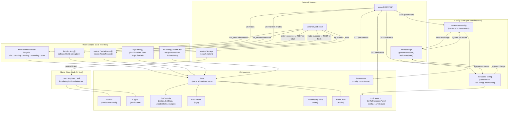

# State Management & Data Flow
**Prompt:** 03-WEB-STATE | **Package:** web | **Reviewed:** July 2025

---

## Executive Summary

sonarftweb uses a deliberately minimal state architecture: React local state,
one `useReducer` for bot lifecycle, and a single Context for auth. There is no
Redux, Zustand, or any external state library. This is appropriate for the
application's scope — one page, one primary feature domain, and a small component
tree. State is well-distributed: each concern owns its own state, and the only
shared state is auth identity via Context. The main observations are: `useBots`
concentrates a large amount of state in one hook (by design), `Parameters` has a
duplicate load pattern that should be consolidated, and the `isSimulating` flag
in `useBots` can drift from the server's actual simulation state because it is
managed locally without server confirmation.

---

## 1. State Management Overview

| Mechanism | Used? | What it manages |
|---|---|---|
| `useState` | ✅ Yes | Bot IDs, logs, orders, trades, loading/error flags, WS URL, simulation toggle, config state, save status, modal visibility |
| `useReducer` | ✅ Yes | Bot lifecycle state machine (`idle → creating → running → removing → error`) |
| Context API | ✅ Yes | Auth identity (`user`, `handleLogin`, `handleLogout`) |
| Redux / Zustand / Recoil | ❌ No | — |
| URL state | ❌ No | No query params or route params carry state |
| `localStorage` | ✅ Yes | Config state cache (`parametersState`, `indicatorsState`) |
| `sessionStorage` | ✅ Yes | Auth token (`sonarft_token`) |
| Server cache / React Query | ❌ No | No caching layer; all data is re-fetched on demand |

**Global vs local split:**
- Global (Context): `user`, `handleLogin`, `handleLogout`
- Hook-scoped (effectively page-global): all bot state in `useBots` — consumed only by `Bots`
- Component-local: config state in `Parameters` and `useConfigCheckboxes`, modal flags in `Bots`

---

## 2. Global State Inventory

### AuthContext (the only true global state)

| State Name | Type | Purpose | Updated From |
|---|---|---|---|
| `user` | `AppUser \| null` | Current authenticated user (id, email) | `handleLogin`, `handleLogout` |
| `handleLogin` | `() => void` | Sets user to `DEFAULT_USER` | Called by auth flow |
| `handleLogout` | `() => void` | Sets user to `null` | Called by nav/session expiry |

`AuthContext` is provided at the root (`App.tsx`) and consumed by `NavBar`,
`Crypto`, and `Bots` (via `useBots` receiving `user.id` as `clientId`).

### useBots hook state (page-scoped, not global)

| State Name | Type | Purpose | Updated From |
|---|---|---|---|
| `wsUrl` | `string \| null` | Resolved WS URL with ticket/token | `resolveWsUrl` effect |
| `logs` | `string[]` | Displayed log lines (capped at 500) | RAF flush from `logBufferRef` |
| `botIds` | `string[]` | Active bot IDs for this client | REST re-fetch on mount + `bot_created`/`bot_removed` |
| `machine` | `BotMachineState` | Bot lifecycle (`lifecycle`, `canRemove`) | `botMachineReducer` via `dispatch` |
| `trades` | `TradeRecord[]` | Trade history | REST re-fetch on `trade_success` |
| `orders` | `TradeRecord[]` | Order history | REST re-fetch on `order_success` |
| `selectedBotId` | `string \| null` | Currently selected bot | User selection + `bot_created` |
| `isLoading` | `boolean` | Initial load in progress | `load()` effect |
| `fetchError` | `string \| null` | Last REST/WS error message | Various error paths |
| `isSimulating` | `boolean` | Local simulation mode toggle | `handleToggleSimulation` |

### useConfigCheckboxes hook state (per-instance)

| State Name | Type | Purpose | Updated From |
|---|---|---|---|
| `config` | `T extends ConfigState` | Current checkbox config | Load effect, `handleCheckboxChange` |
| `saveStatus` | `"saving" \| "saved" \| "error" \| null` | Save feedback | `handleSave` |

### Parameters component state (local, duplicates useConfigCheckboxes pattern)

| State Name | Type | Purpose | Updated From |
|---|---|---|---|
| `config` | `ParametersConfig` | Current parameters config | Load effect, `handleCheckboxChange`, `handleStrategyChange` |
| `saveStatus` | `"saving" \| "saved" \| "error" \| null` | Save feedback | `handleSave` |

---

## 3. Data Flow Analysis

### Bot Management

```
REST GET /bots?client_id=
    → useBots.load() effect
        → setBotIds([...])
        → dispatch(BOT_CREATED) if ids.length > 0
        → fetchAllOrders / fetchAllTrades → setOrders / setTrades

WebSocket event: bot_created
    → REST GET /bots?client_id= (re-fetch)
        → setBotIds([...])
        → setSelectedBotId(last id)
        → dispatch(BOT_CREATED)

WebSocket event: bot_removed
    → dispatch(BOT_REMOVED)
    → setBotIds([])
    → setSelectedBotId(null)

User action: handleCreate
    → socket.send({ type: "keypress", key: "create" })
    → dispatch(CREATE_REQUESTED)
    → (server responds with bot_created event → see above)
```

Data originates from the server (REST + WebSocket). The UI is a projection of
server state, re-fetched on events. There is no optimistic update — the UI waits
for server confirmation before updating.

### Indicators Configuration

```
On mount (Indicators → ConfigCheckboxPanel → useConfigCheckboxes):
    1. Try REST GET /indicators?client_id=
    2. On failure: try localStorage["indicatorsState"]
    3. On failure: try REST GET /indicators/defaults
    4. On failure: use bundled indicatorOptions.json (via getDefaultIndicators fallback)

On checkbox change:
    → setConfig(next) + localStorage.setItem("indicatorsState", JSON.stringify(next))

On save:
    → REST PUT /indicators?client_id= (full config)
    → setSaveStatus("saved" | "error")
```

### Trading Parameters

```
On mount (Parameters component):
    1. Try REST GET /parameters?client_id=
    2. On failure: try localStorage["parametersState"]
    3. On failure: try REST GET /parameters/defaults

On checkbox/strategy change:
    → setConfig(next) + localStorage.setItem("parametersState", JSON.stringify(next))

On save:
    → REST PUT /parameters?client_id= (full config)
    → setSaveStatus("saved" | "error")
```

Note: `Parameters` implements this load chain inline, duplicating the logic in
`useConfigCheckboxes`. The data flow is identical; only the implementation differs.

### Real-time Data (WebSocket)

```
WebSocket message arrives
    → useBots socket.onmessage handler
        → parseMessage(event.data) → WsMessage

    if type === "log":
        → logBufferRef.current.push(message)
        → (RAF loop flushes buffer → setLogs every ~16ms)

    if type === "order_success":
        → fetchAllOrders(botIdsRef.current, clientId) → setOrders

    if type === "trade_success":
        → fetchAllTrades(botIdsRef.current, clientId) → setTrades

    if type === "bot_created" | "bot_removed":
        → dispatch(action) + REST re-fetch of bot IDs

    if type === "error":
        → setFetchError(message)
```

### Simulation Mode

```
User clicks mode toggle (paper → live):
    → Bots.handleModeToggleClick() → setShowLiveConfirm(true)
    → User confirms → handleConfirmLive() → handleToggleSimulation()

handleToggleSimulation:
    → setIsSimulating(prev => !prev)  [local state update]
    → socket.send({ type: "keypress", key: "set_simulation", botid, value: next })
    [server updates its own state; no confirmation event sent back]
```

`isSimulating` is a local optimistic flag. The server does not send a confirmation
event after `set_simulation`, so the frontend's `isSimulating` can diverge from
the server's actual state if the WebSocket message is lost or the server rejects
the command silently.

---

## 4. Component Props Analysis

The component tree is shallow. Maximum prop drilling depth is **2 levels**
(App → Crypto → Bots → BotControls/BotConsole).

```
App
└── Crypto                    receives: nothing (reads AuthContext)
    ├── Parameters             receives: clientId (1 level)
    ├── Indicators             receives: clientId (1 level)
    └── Bots                   receives: user (1 level)
        ├── BotControls        receives: botIds, botState, selectedBotId, wsOpen, 4 callbacks (2 levels)
        ├── BotConsole         receives: logs (2 levels)
        ├── TradeHistoryTable  receives: rows, caption (2 levels)
        └── ProfitChart        receives: trades (2 levels)
```

**Prop drilling assessment:** None. Two levels is not drilling — it is normal
component composition. No component receives props it does not use.

**Props interface quality:** All props are TypeScript-typed with explicit
interfaces. No `any` types in prop definitions. `React.memo` is applied to all
leaf display components (`BotControls`, `BotConsole`, `TradeHistoryTable`,
`ProfitChart`), which is correct given they receive stable props from `useBots`.

**Unnecessary props:** None identified. Each prop passed to child components is
used by that component.

---

## 5. Context Usage

### AuthContext

- **Created in:** `hooks/AuthProvider.tsx` via `createContext`
- **Provider placement:** Root of the app in `App.tsx` — wraps everything
- **Consumers:** `NavBar` (reads `user.email`), `Crypto` (reads `user`), `BotControls` (indirectly via `Bots` receiving `user`)
- **Value memoization:** `useMemo` wraps the context value object, preventing unnecessary re-renders when `user` reference is stable
- **Callbacks memoized:** `handleLogin` and `handleLogout` are `useCallback` with empty deps — stable references

**Re-render impact:** When `user` changes (login/logout), all three consumers
re-render. This is correct and expected. The `useMemo` on the context value
prevents re-renders when the provider itself re-renders for unrelated reasons.

**Context splitting:** Only one context exists. Given the app's size, splitting
is not needed. If auth state grows (e.g. adding roles, permissions, token expiry),
splitting into `AuthStateContext` and `AuthDispatchContext` would be worth
considering.

---

## 6. Reducer Patterns

### botMachineReducer (in useBots.ts)

```typescript
type BotLifecycle = "idle" | "creating" | "running" | "removing" | "error";

type BotMachineAction =
    | { type: "CREATE_REQUESTED" }
    | { type: "BOT_CREATED" }
    | { type: "REMOVE_REQUESTED" }
    | { type: "BOT_REMOVED" }
    | { type: "ERROR" };
```

**State transitions:**

| From | Action | To | canRemove |
|---|---|---|---|
| `idle` | `CREATE_REQUESTED` | `creating` | false |
| `creating` | `BOT_CREATED` | `running` | true |
| `running` | `REMOVE_REQUESTED` | `removing` | true |
| `removing` | `BOT_REMOVED` | `idle` | false |
| any | `ERROR` | `error` | unchanged |

**Assessment:**
- ✅ Pure function — no side effects in the reducer
- ✅ Exhaustive `default` case returns current state
- ✅ Action types are discriminated union — type-safe
- ✅ `canRemove` is derived from lifecycle, not independently tracked
- ⚠️ No transition from `error` back to `idle` — once in `error`, the machine
  is stuck. A page reload is required to recover. An `ERROR_CLEARED` or `RESET`
  action would allow recovery without reload.
- ⚠️ No transition guard for invalid transitions (e.g. `BOT_CREATED` while
  `idle`). The reducer silently accepts any action in any state. This is safe
  given the current call sites but could mask bugs if new code paths are added.

**Action creators:** Inline objects used at call sites (`dispatch({ type: "BOT_CREATED" })`).
No action creator functions. Acceptable at this scale.

**Middleware / DevTools:** None. No Redux DevTools integration. State changes are
not logged. Debugging requires adding `console.log` manually or using React
DevTools.

---

## 7. API Data Management

**Normalization:** None. API responses are stored as flat arrays (`TradeRecord[]`,
`string[]`). No normalization into maps or entity stores. This is appropriate
given the data volume — a few hundred trade records at most.

**Cache invalidation:** Event-driven. The frontend re-fetches orders/trades on
`order_success` / `trade_success` WebSocket events. Config state is re-fetched
on mount. There is no TTL-based or manual cache invalidation.

**Optimistic updates:** None for bot lifecycle or trade history. The simulation
toggle (`isSimulating`) is the only optimistic update — the UI flips immediately
without waiting for server confirmation.

**Conflict resolution:** The server is the source of truth. On reconnect or
remount, the frontend re-fetches from the server, overwriting any local state.
Config state uses a priority chain (server > localStorage > defaults), so server
data always wins when available.

**Loading/error states:**

| Operation | Loading state | Error state |
|---|---|---|
| Initial bot load | `isLoading` boolean | `fetchError` string |
| Config load | None (silent fallback) | None (silent fallback) |
| Config save | `saveStatus === "saving"` | `saveStatus === "error"` |
| History re-fetch | None | `fetchError` string |
| WS connection | `wsOpen` boolean | `wsError` string |

The absence of a loading state for config load is acceptable because the
localStorage fallback provides immediate data, making the load feel instant.

---

## 8. Local Storage & Persistence

| Key | Storage | Type | Purpose | Expiry |
|---|---|---|---|---|
| `parametersState` | `localStorage` | `ParametersConfig` JSON | Config cache for offline/fallback | None |
| `indicatorsState` | `localStorage` | `IndicatorsConfig` JSON | Config cache for offline/fallback | None |
| `sonarft_token` | `sessionStorage` | JWT string | Auth token | Tab close |

**Hydration:** Config state is hydrated synchronously in `useConfigCheckboxes`
via the `useState` initializer function:

```typescript
const [config, setConfig] = useState<T>(() => {
    try {
        const stored = localStorage.getItem(storageKey);
        return stored ? (JSON.parse(stored) as T) : defaultState;
    } catch {
        return defaultState;
    }
});
```

This means the component renders with cached data on the first paint, before the
server response arrives. The server response then overwrites it if available.

**Sync:** `localStorage` is written synchronously on every checkbox change and
after every successful server load. In-memory state and storage are always in
sync after a change.

**Encryption:** None. Config state (exchange names, symbol names, indicator
selections) is not sensitive. The auth token in `sessionStorage` is not encrypted
— this is standard practice for JWT storage in SPAs.

**Expiration:** No TTL on localStorage entries. Stale config from a previous
session will be used as a fallback if the server is unavailable. This is
intentional — stale config is better than no config for a trading interface.

---

## 9. Real-time Data Integration

**WebSocket events → state updates:**

| Event | State updated | Mechanism |
|---|---|---|
| `log` | `logs` (via `logBufferRef`) | RAF batch flush |
| `bot_created` | `botIds`, `selectedBotId`, `machine` | REST re-fetch + dispatch |
| `bot_removed` | `botIds`, `selectedBotId`, `machine` | Direct state reset + dispatch |
| `order_success` | `orders` | REST re-fetch via `fetchAllOrders` |
| `trade_success` | `trades` | REST re-fetch via `fetchAllTrades` |
| `error` | `fetchError` | Direct `setFetchError` |
| `connected`, `ping`, `bot_stopped` | None | Silently ignored |

**Merging strategy:** Full replacement. On `order_success` / `trade_success`,
the entire history array is replaced with the fresh server response. No merging
or deduplication of individual records.

**Consistency:** The `botIdsRef` ref is kept in sync with `botIds` state via a
`useEffect`. The `onmessage` handler uses `botIdsRef.current` (not `botIds`) to
avoid stale closure issues when fetching history after events. This is a correct
and deliberate pattern.

**Duplicate event handling:** No deduplication. If `order_success` fires twice
in rapid succession, two concurrent `fetchAllOrders` calls will be made. The
second response will overwrite the first, which is correct but wasteful. Given
the API's rate limit (60/min for reads), this is unlikely to cause issues in
practice.

**RAF log batching:** Log messages accumulate in `logBufferRef` (a ref, not
state) and are flushed to `logs` state at most once per animation frame (~60fps).
This prevents React from re-rendering on every individual log message at high
frequency. The buffer is capped at 500 lines via slice.

---

## 10. Performance & Re-renders

**Memoization inventory:**

| Location | Technique | Purpose |
|---|---|---|
| `AuthProvider` | `useMemo` on context value | Prevents context consumers re-rendering when provider re-renders |
| `AuthProvider` | `useCallback` on `handleLogin`, `handleLogout` | Stable references for context value |
| `useBots` | `useCallback` on all 4 handlers | Stable references passed to `BotControls` |
| `Parameters` | `useCallback` on `handleCheckboxChange`, `handleStrategyChange`, `handleSave`, `scheduleStatus` | Stable references |
| `Parameters` | `useMemo` on `exchangeEntries`, `symbolEntries` | Avoids `Object.entries` on every render |
| `useConfigCheckboxes` | `useCallback` on `handleCheckboxChange`, `handleSave` | Stable references |
| `ConfigCheckboxPanel` | `useMemo` on `stateKeys` | Avoids array recreation on every render |
| `ConfigCheckboxPanel` | `useCallback` on `renderCheckboxes` | Stable render function |
| `ProfitChart` | `useMemo` on `data` | Avoids recomputing cumulative P&L on every render |
| `BotControls` | `React.memo` | Skips re-render when props are unchanged |
| `BotConsole` | `React.memo` | Skips re-render when `logs` reference is unchanged |
| `TradeHistoryTable` | `React.memo` | Skips re-render when `rows` reference is unchanged |
| `ProfitChart` | `React.memo` | Skips re-render when `trades` reference is unchanged |

**Re-render triggers analysis:**

- `useBots` has 10 state variables. Any state update re-renders `Bots` and all
  its children. `React.memo` on `BotControls`, `BotConsole`, `TradeHistoryTable`,
  and `ProfitChart` prevents unnecessary child re-renders when their specific
  props haven't changed.
- The RAF log flush calls `setLogs` at most 60 times/second. Each call re-renders
  `Bots` and `BotConsole`. `BotControls`, `TradeHistoryTable`, and `ProfitChart`
  are protected by `React.memo` and will not re-render during log flushes since
  their props don't change.
- `AuthContext` value is memoized — context consumers only re-render on actual
  `user` changes (login/logout), not on every `AuthProvider` render.

**Potential unnecessary re-renders:**

- `Bots` re-renders on every log flush (up to 60/s) because `logs` is in the
  same state scope as `botIds`, `orders`, etc. The modal visibility state
  (`showLiveConfirm`, `showRemoveConfirm`) is also in `Bots`, meaning a log
  flush re-evaluates the modal JSX. This is cheap but could be avoided by
  moving log state into a dedicated child component.
- `Parameters` re-renders on every `config` change (each checkbox click writes
  to state). The `useMemo` on `exchangeEntries` and `symbolEntries` prevents
  `Object.entries` from running, but the full component still re-renders.

---

## 11. Developer Experience

**Debugging:** Standard React DevTools. No Redux DevTools or custom state
logging. The bot state machine transitions are not logged, making it harder to
trace lifecycle issues without adding instrumentation.

**Time-travel debugging:** Not available. `useReducer` does not integrate with
Redux DevTools out of the box.

**Logging:** No state change logging in production. In development, `vitals.ts`
logs Web Vitals to the console. No state transition logging.

**Testing:** State is well-isolated in hooks, making it straightforward to test
with React Testing Library's `renderHook`. The MSW v2 mock server handles API
responses. The `botMachineReducer` is a pure function and can be unit-tested
directly without rendering.

**Documentation:** The bot state machine transitions are documented via the
TypeScript discriminated union types. The `BotLifecycle` type and
`BotMachineAction` union serve as inline documentation of valid states and
transitions.

---

## 12. State Flow Diagram



---

## 13. Issue Analysis

| Issue | Severity | Detail |
|---|---|---|
| `isSimulating` can diverge from server state | Medium | The simulation toggle is optimistic — the UI flips immediately but the server sends no confirmation event. If the `set_simulation` WebSocket message is lost or the server rejects it silently, the UI shows the wrong mode. A `bot_simulation_changed` confirmation event from the server, or re-fetching bot state on reconnect, would fix this. |
| `error` lifecycle state has no recovery path | Low | Once `botMachineReducer` enters `error`, there is no action to return to `idle`. The user must reload the page. Adding an `ERROR_CLEARED` action dispatched on reconnect or user acknowledgement would allow in-page recovery. |
| `Parameters` duplicates `useConfigCheckboxes` load logic | Low | The three-tier load chain (server → localStorage → defaults) is implemented inline in `Parameters` and also in `useConfigCheckboxes`. Refactoring `Parameters` to use `ConfigCheckboxPanel` + `useConfigCheckboxes` (as `Indicators` does) eliminates ~40 lines of duplicate state logic. |
| No deduplication of concurrent history re-fetches | Low | Rapid `order_success` / `trade_success` events trigger concurrent `fetchAllOrders` / `fetchAllTrades` calls. The last response wins, which is correct, but intermediate responses cause unnecessary re-renders. A debounce (e.g. 200ms) on the re-fetch trigger would reduce noise. |
| `Bots` re-renders on every log flush | Info | `logs` state lives in the same hook as `botIds`, `orders`, etc. Every RAF flush (up to 60/s) re-renders `Bots` and re-evaluates modal JSX. `React.memo` on children prevents their re-renders, but `Bots` itself is not memoized. Extracting `BotConsole` log management into a separate component with its own state would isolate log re-renders. |
| No state transition logging | Info | Bot lifecycle transitions are not logged. Adding a `useEffect` that logs `machine.lifecycle` changes in development would make debugging lifecycle issues significantly easier. |
| `localStorage` config has no expiry | Info | Stale config from a previous session is used as a fallback indefinitely. For a trading application, using exchange/symbol config from weeks ago could be surprising. A timestamp-based TTL (e.g. 7 days) would prevent very stale fallbacks. |
