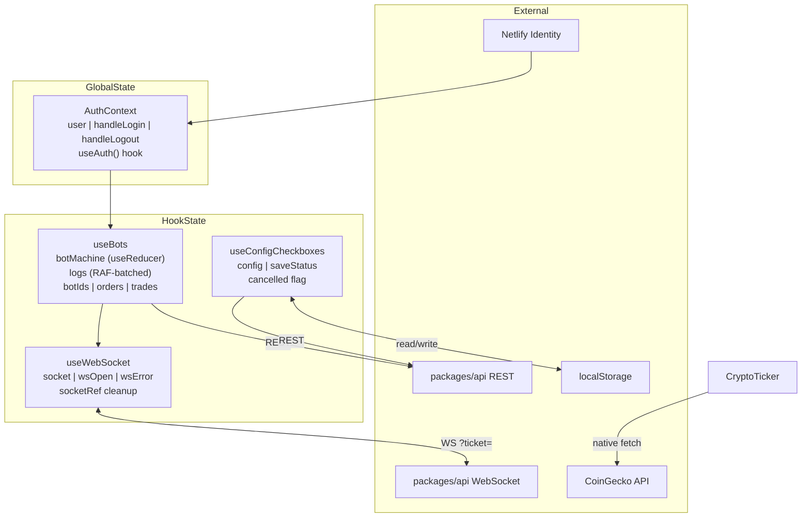

# Prompt 03 — State Management & Data Flow

**Package:** `packages/web`  
**Prompt ID:** 03-WEB-STATE  
**Output File:** `docs/state-management/data-flow.md`  
**Reviewed:** July 2025 | **Updated:** July 2025 (post-implementation)

---

## Implementation Status

| Finding | Severity | Status |
|---|---|---|
| Stale `botIds` closure in `onmessage` | Medium | ✅ **Resolved** — `botIdsRef` keeps current list in closure |
| `useConfigCheckboxes` suppressed exhaustive-deps | Medium | ✅ **Resolved** — all deps explicit; `cancelled` flag added |
| `useBots` has no unit tests | Medium | ✅ **Resolved** — 20 tests added covering all WS events and lifecycle |
| `botState` + `botStatus` two variables for one state machine | Low | ✅ **Resolved** — unified with `useReducer`; explicit transitions |
| Log array spread on every message | Low | ✅ **Resolved** — RAF batching; max 60 state updates/second |
| `BotControls`, `BotConsole`, `TradeHistoryTable` not memoized | Low | ✅ **Resolved** — `React.memo` added to all four hot components |
| No loading state for config fetch | Low | ⚠️ **Deferred** — forms render from localStorage immediately; acceptable |
| No loading state for order/trade history | Low | ⚠️ **Deferred** — table shows empty until WS event triggers fetch |
| localStorage config has no schema version | Low | ⚠️ **Deferred** — noted as post-launch |
| Redux Toolkit stack unused | Low | ✅ **Resolved** — recharts v3 requires it internally; documented |

---

## 1. State Management Overview

| Mechanism | Used for | Location |
|---|---|---|
| `useReducer` | Bot lifecycle state machine | `useBots` |
| `useState` in custom hooks | WS connection, trade history, config forms | `useBots`, `useWebSocket`, `useConfigCheckboxes` |
| `useState` in components | Crypto ticker prices, live confirm modal | `CryptoTicker`, `Bots` |
| React Context API | Auth user, login/logout handlers | `AuthProvider` / `AuthContext` |
| `localStorage` | Config form state (parameters, indicators) | `useConfigCheckboxes` |
| Redux (recharts internal) | Recharts internal state only | Not used by app code |

---

## 2. Global State Inventory

### AuthContext (unchanged)

| State | Type | Purpose | Updated From |
|---|---|---|---|
| `user` | `NetlifyUser \| null` | Authenticated user identity | Netlify Identity events |
| `handleLogin` | `() => void` | Opens Netlify Identity modal | Stable `useCallback` |
| `handleLogout` | `() => void` | Logs out and clears user | Stable `useCallback` |

**New:** `useAuth()` convenience hook exported — consumers no longer need `useContext(AuthContext)` directly.

---

## 3. Bot State Machine (updated — useReducer)

```
                  CREATE_REQUESTED
idle ─────────────────────────────► creating
                                        │
                                   BOT_CREATED
                                        │
                                        ▼
removing ◄──────────────────────── running
    │       REMOVE_REQUESTED              │
    │                                     │ ERROR
    │ BOT_REMOVED                         ▼
    └──────────────────────────────► error
                                        │
                                   BOT_REMOVED
                                        │
                                        ▼
                                      idle
```

```ts
type BotLifecycle = "idle" | "creating" | "running" | "removing" | "error";

type BotMachineAction =
    | { type: "CREATE_REQUESTED" }
    | { type: "BOT_CREATED" }
    | { type: "REMOVE_REQUESTED" }
    | { type: "BOT_REMOVED" }
    | { type: "ERROR" };
```

Invalid state combinations are now impossible. Legacy `botState`/`botStatus` derived from machine for backward compatibility.

---

## 4. Log Batching (new)

```ts
// Messages accumulate in a ref — no setState per message
logBufferRef.current.push(msg.message ?? "");

// RAF flush drains buffer at most 60fps
const flush = () => {
    if (logBufferRef.current.length > 0) {
        const incoming = logBufferRef.current.splice(0);
        setLogs((prev) => {
            const next = [...prev, ...incoming];
            return next.length > MAX_LOG_LINES ? next.slice(-MAX_LOG_LINES) : next;
        });
    }
    rafRef.current = requestAnimationFrame(flush);
};
```

At 100 log messages/second, `setLogs` is called at most 60 times/second instead of 100.

---

## 5. useConfigCheckboxes (updated)

```ts
useEffect(() => {
    let cancelled = false;

    const load = async () => {
        try {
            const data = await fetchFn(clientId);
            if (!cancelled && data) { setConfig(pickKeys(data)); return; }
        } catch { /* fall through */ }

        if (cancelled) return;
        // ... localStorage fallback, then defaultFn()
    };

    load();
    return () => { cancelled = true; };
}, [clientId, storageKey, fetchFn, defaultFn, stateKeys]); // all deps explicit
```

- `eslint-disable` suppression removed
- `cancelled` flag prevents stale responses from overwriting correct state
- `pickKeys` helper reduces type assertion repetition

---

## 6. React.memo on Hot Components

`BotControls`, `BotConsole`, `TradeHistoryTable`, and `ProfitChart` are now wrapped in `React.memo`. During high-frequency log streaming, only `BotConsole` re-renders (its `logs` prop changes); the other three remain stable.

---

## 7. State Flow Diagram (updated)



---

## Remaining Open Items

| Item | Priority | Notes |
|---|---|---|
| Loading state for config fetch | Low | Forms render from localStorage immediately — acceptable UX |
| Loading state for history fetch | Low | Table empty until WS event; deferred |
| localStorage schema version | Low | Stale keys sent to API after schema change; deferred |
